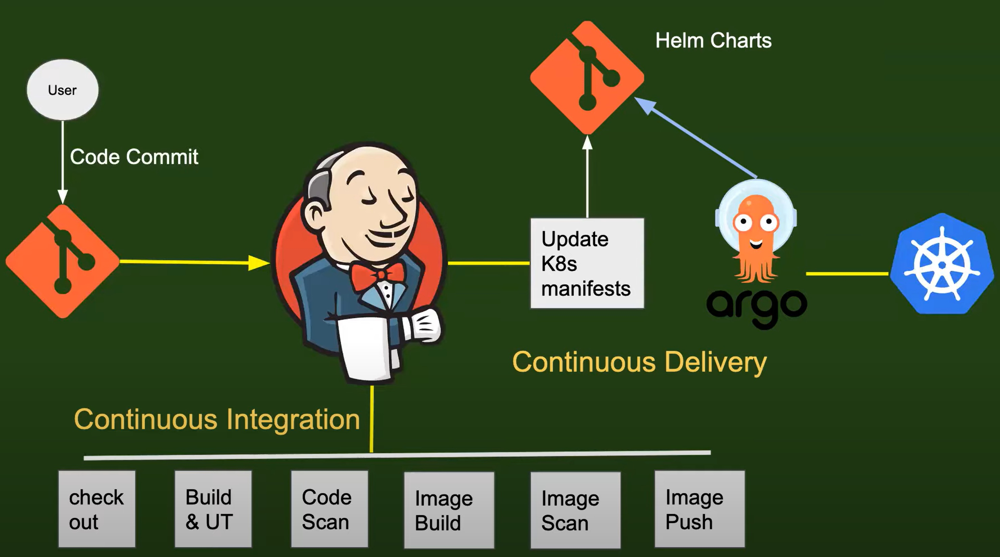

# CICD (Continuous Integration Continuous Delivery)

Abhishek Veermalla [Video](Https://www.youtube.com/watch?v=CmVxoNkkACQ&list=PLdpzxOOAlwvLUH6ww022l7OZGakJYP9WY)

## Day 18 : Introduction to CICD 
CI/CD (Continuous Integration and Continuous Deployment/Delivery) helps automate key steps in the software delivery lifecycle. Every application must pass through these stages before it is delivered to customers.

### 🔁 Stages in CI/CD:

1. **Unit Testing** – Verify the functionality of newly developed code modules.

2. **Static Code Analysis** – Check code formatting, adherence to coding standards, and removal of warnings.
3. **Code Quality & Vulnerability Scanning** – Detect security flaws and code smells (e.g., via SonarQube).
4. **Automated Testing** – Perform end-to-end, regression, or functional testing.
5. **Report Generation** – Generate test and quality reports.
6. **Deployment** – Deliver the application to various environments (Dev, Staging, Prod).

### 🔧 CI/CD Workflow Overview:
- CI/CD pipelines are triggered when developers push code to a **Version Control System (VCS)** like `GitHub` or `GitLab`.
- **Jenkins**, a popular legacy CI/CD orchestrator, coordinates the execution of different tools required for each step in the pipeline.

#### Example: Java Application CI/CD Flow using Jenkins

```
Code Commit to VCS 
  ➡ CI/CD Tool (e.g., Jenkins)
      ➡ 1. Build Tool: Maven (For building Java application)
      ➡ 2. Testing Tools: JUnit, JaCoCo (For Unit/Functional/Regression Testing, integration and coverage)
      ➡ 3. Code Quality: SonarQube (static analysis, vulnerabilities)
      ➡ 4. ALM Reporting (Application Lifecycle Management): Popular tools include Atlassian Jira, Azure DevOps, 
            SpiraTeam, Jama Connect, OpenText ALM Octane etc.
      ➡ 5. Deployment: Docker, Kubernetes, AWS EC2, or any cloud VMs
```
- The **DevOps engineer** configures all the above tools via Jenkins pipelines to automate tasks on code push events.

### 🌐 Jenkins Deployment Stages:
Jenkins can deploy the application to one of the following environments:

1. **Development** – Used by developers to verify new features.
2. **Staging** – Pre-production environment; mimics production but with fewer resources. Used for final testing.
3. **Production** – Live environment; customer-facing and fully scaled.

- **Promotions** from one environment to another can be automated or require **manual approval**.

### 🧱 Jenkins Architecture & Limitations:
- `Jenkins` and `Hudson` are the legacy CI tools. 

- Jenkins is a binary which is installed on a machine, a master machine and keep on connecting EC2 instances depending upon load.
- Jenkins pipelines need to be run only when there are any code changes. However, Jenkins requires its instance to be run always. 
- So, to avoid this now a days GitHub actions, which is event driven CICD tool, is used. 
- GitHub action spins up a docker or kubernetes pod whenever a code is committed to a repo.
- This **kubernetes pod** or **a docker container** can be created on **a runner**, **a worker node**, on **Azure cloud** or **EC2** or **any kubernetes cluster**, **which runs CICD pipeline**.
- These pods are deleted after finishing their tasks, thus saving the resources.
- Thus instead of creating a separate Jenkins server for each repo or team we can create a single GitHub action for all these repos which will launch pods and complete CICD pipeline.

### 🔄 Jenkins Alternatives:
- Following are the **alternatives to the Jenkins CICD tool** -

  1. GitHub Actions

  2. GitLab CI/CD
  3. CircleCI
  4. TeamCity
  5. Bamboo
  6. TravisCI
  7. CodeShip
- GitHub actions is a better tool than Jenkins as though Jenkins has support for the webhooks provided by Git, it is not event driven by default.  
- GitHub actions provides the feature where pipelines can be configured across multiple projects. 

## Explain the CI/CD pipeline implementation (Interview Question)

<br> <br>

<div style="text-align: center;">

</div>
<br> <br>

- The CICD implementation starts with a VCS such as `GitHub`/`GitLab` and ends at deployment platform such as `Kubernetes`.
  1. **Trigger** – Developer commits code to a Git repo.
  2. **Webhook** – Git triggers the CI/CD orchestrator (e.g., Jenkins, GitHub Actions).

- Jenkins pipeline does the task of continuous integration, which includes following sub-tasks that are included in the Jenkins File -

  1. Check out 
      - Pull the code from the Git repo. 
      
  2. Build & Unit Test 
      - Compile the code and execute unit tests (e.g., JUnit).
      
  3. Code Scan 
      - Perform static code analysis for quality/security. 
      - Example, SonarQube, SonarLint and SonarCloud tools are used for this.
      
  4. Image Build 
      - Build a docker/container image using `Dockerfile` from github
       
  5. Image Scan 
      - Check for vulnerabilities in the Docker image.
      
  6. Image Push 
      - Push the image to a container registry like DockerHub, AWS ECR, or Quay.io.

> **Declarative Jenkins pipelines** are preferred over **Scripted Jenkins pipelines** as they are more readable and require less Groovy scripting knowledge.

### 🐳 CD with Kubernetes:
- Built Docker images are referenced in **Kubernetes YAML manifests**, stored in a Git repo.
- **GitOps tools** like **Argo CD** or **Flux CD** continuously monitor these repos.

- Upon detecting a new commit (updated image tag or YAML file), they **automatically apply** the changes to the Kubernetes cluster.
- Alternative tools for Kubernetes deployments include:
  - `kubectl` CLI
  - `helm` (Helm Charts)
  - `ansible`, `bash`, or `python` scripts
  
## Day 19 : Jenkins Zero to Hero | 3 Projects Live | Docker Agent

