# Docker Tutorial For Beginners - Docker Fundamentals - CKA Full Course 2024 Notes 

>          By courtesy of "Tech Tutorials with Piyush" -  Youtube Channel  

<br>

---
# <pre style="padding: 0; margin: 0 0"> <div style="padding: 0 40%">   Day 1 </div>  </pre>
 
## <span style="color: #e1881c"> Why Containers ?  </span>

- Dockers/Containers were developed to bring consistency and portability across development, test and production environments. So that if a 
  code is tested in development environment then it should also work in production environment.
<br> <br>
<div style="text-align: center;">
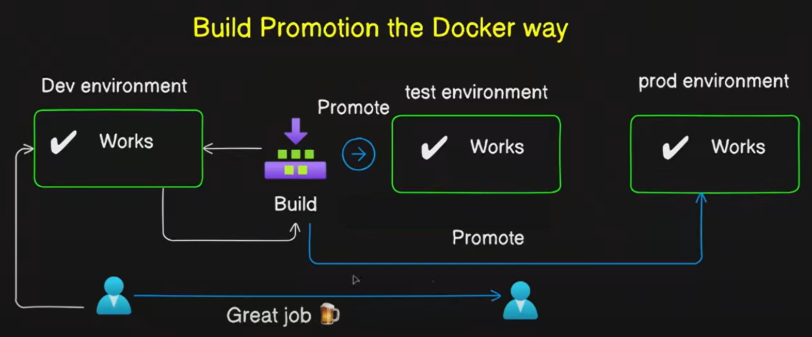
</div>
<br> <br>

- Container provides an isolated environment for application code along with the libraries, essential components of operating system, dependencies
  and everything that an application needs, irrespective of the operating system on which you are running this container on i.e. host OS.
- Containers are some times called as lightweight sandbox environment because they do not contain entire operating system but the bare minimum of 
  operating system only essential for that application.
- Docker or Podman are the platforms that enable build, ship and run the containers.

## Containers Vs Virtual Machines

- Virtual machines can be considered as an individual house whereas containers can be considered as a building consisting of apartments.

<br> <br> <div style="text-align: center;">
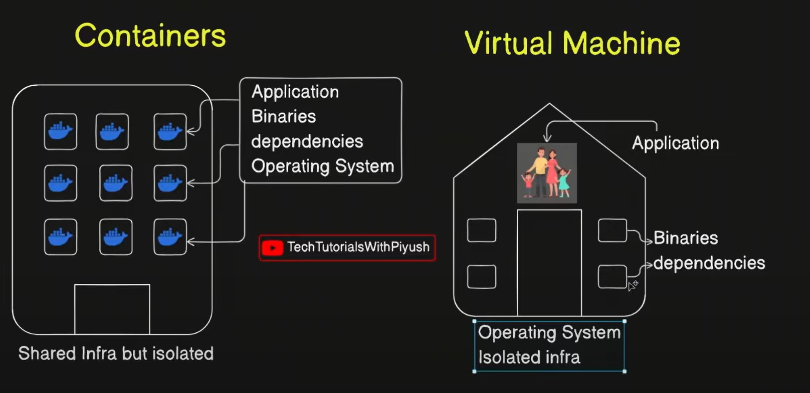 
</div> <br> <br>

- Containers though are isolated and contain OS, libraries and dependencies, they share lot of resources across other containers through the 
  container runtime environments such as Docker runtime etc.
- Thus use of containers leads to minimum wastage of resources.
- Virtualization enables us to run multiple instances of different operating systems concurrently on a single machine.
- Virtual machines is a Software emulation of a physical machine which allows multiple OS to run on single physical machine. Virtual machines 
  are isolated from each other and the host OS.
- Container engine allows to run multiple containers instances on single OS kernel. It is similar to 'Hypervisor' which allows running multiple 
  Operating systems on single Operating System.

<br> <br> <div style="text-align: center;">
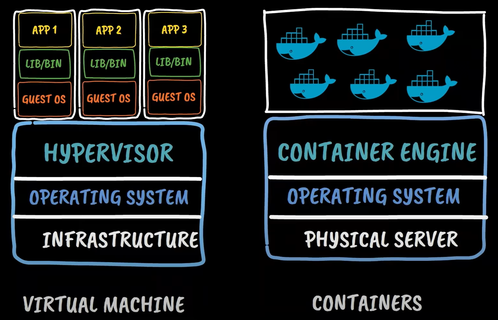 
</div> <br> <br>

- Containers are light weight compared to virtual machines and that is the only advantage they have over virtual machines.

## Simple Docker Flow
- Dockerfile - Contains a set of instruction on how to create an image.

<br> <div style="text-align: center;">
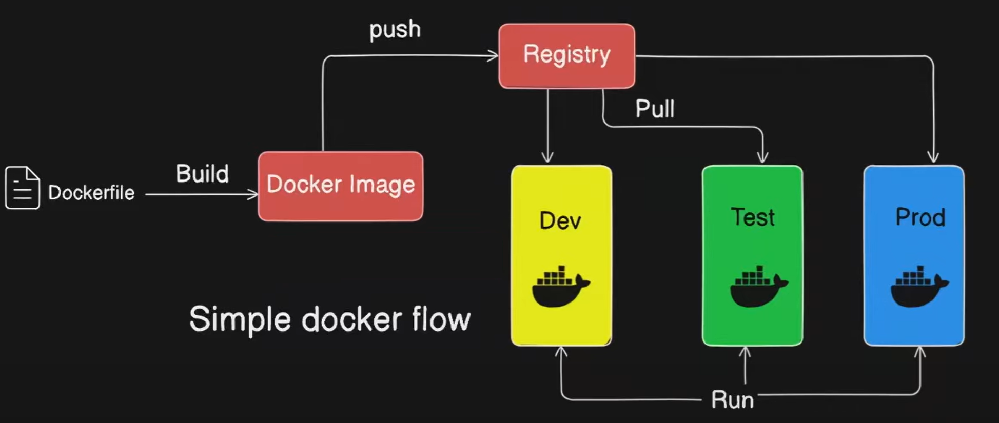 
</div> <br>

- Dockerfile is build to create a Docker image which is shippable and contains a copy of your code and all its dependencies along with OS components.
- Containers can not be shifted/shipped from one environment to another, it is done with the help of the Docker image.
- Docker images can not be directly pushed to dev/test/production environments directly, they need to be stored in registry first.
- 'Registry' is similar to version control system for images.
  e.g. 'DockerHub' is an example of a Docker registry.
- Docker images are in the form of binaries.
- This image will be pulled by different environments and an instance will be created out of this image using 'docker run' command. This instance is 
  known as 'container'.

## Docker Architecture
- Dockerfile client is an application through which a user will be running docker commmands.

<br> <div style="text-align: center;">
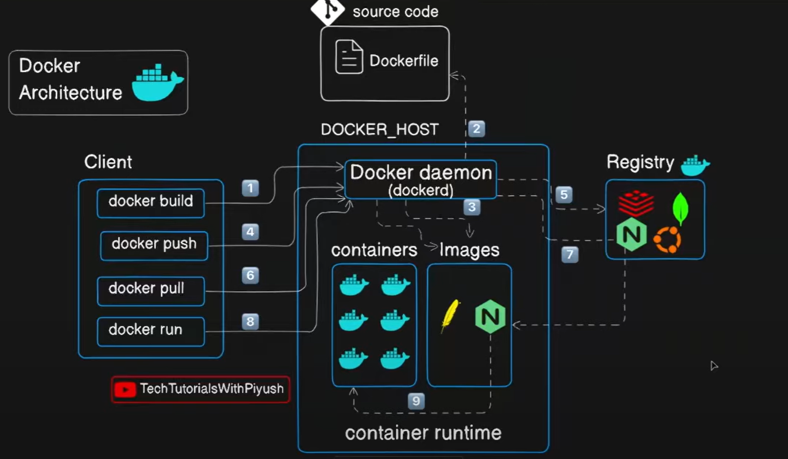 
</div> <br>

- 'Dockerfile' (default name) is usually stored on version control systems such as github.
- 'docker build' command is issued to the docker daemon - dockerd, which builds the image and stores it locally (on the host where your docker is running), 
- 'docker push' command is issued to the docker daemon - docker, which pushes command from local registry to image registry such as DockerHub, 
  Artifact registry, JFrog artifactory or Nexus registry.
- 'docker pull' command is issued to the docker daemon - docker, on the machine where you want to run the container, which pulls the image from the global 
  registries to the local registry.
- 'docker run' command is issued to the docker daemon - docker, which instructs the 'container runtime' to spin up the container based on the image pulled 
  and command issued to it.
  
<br>
<!-----------------------------------------------------------------------  This is comment   --------------------------------------------------------------------->
<!---------------------------------------------------------------------------------------------------------------------------------------------------------------->

--- 
# <pre style="padding: 0; margin: 0 0"> <div style="padding: 0 40%">   Day 2 </div>  </pre>

## <span style="color: #e1881c"> How to Dockerize a Project ? </span>
- Go to [play-with-docker.com](https://labs.play-with-docker.com/) website and sign up using docker credentials. It will provide you with a sandbox 
  environment to do docker coding. Or else you can install Docker desktop on your machine and practice there.
- 'docker build' while creating an image from the dockerfile, it creates images in layers and combines when required. While shipping i.e. pushing the images docker 
  disintegrate the images into layers, ship them and again recombines them.
- when you push the image using 'docker push' command, the image is compressed and stored on dockerhub.
- Flow :- 
  1. Create docker file
  2. Build the image from 'Dockerfile' using 'docker build' command 
  3. Tag the image as per the repo name from 'dockerhub.com' 
  4. Login to docker from your terminal
  5. Push the image to 'dockerhub.com'
  6. You can pull this image from 'dockerhub.com' to your work environment
  7. Check the downloaded images using 'docker images' command
  8. Run the image to create a container using 'docker run' command, you can run in detached mode and also expose the container ports to host machine to access the app 
  9. Run 'localhost:3000' in your browser to access the app.
- For docker commands check file 'Docker-commands.txt' file from notes.

<br>
<!-----------------------------------------------------------------------  This is comment   --------------------------------------------------------------------->
<!---------------------------------------------------------------------------------------------------------------------------------------------------------------->

--- 
# <pre style="padding: 0; margin: 0 0"> <div style="padding: 0 40%">   Day 3 </div>  </pre>

## <span style="color: #e1881c"> Docker Multistage Builds </span>
- Docker multistage is used to reduce the build size of the image.
  
- The Ubuntu base image will come with lot of system dependencies such as apt packages and apt repositories. But to run a Python application, you just need 
  Python run time, to run a Java application you just need a Java runtime nothing else. However, for building an application you might require lot of dependencies.

- The statically typed languages, such as GoLang, do not even need runtime environments to run an application. (GoLang is a strongly typed language that means the 
  type of the variables need to be specified at the compile time itself, type checking will happen while compiling and operations are not allowed among variables of 
  different data type.)

- To solve this problem docker introduced multistage builds. 
  
- In multi-stage builds, the docker file can be divided into multiple sections/stages such as resource heavy section and resource light section and binaries from one
  stage will be copies to the next stage which will have very minimalistic base image like Distroless image.

- In multi-stage builds, only the image generated by the final stage will be used.
  
- Non Multistage Docker file
    ```
      ###########################################
      # BASE IMAGE
      ###########################################

      FROM ubuntu AS build

      RUN apt-get update && apt-get install -y golang-go

      ENV GO111MODULE=off

      COPY . .

      RUN CGO_ENABLED=0 go build -o /app .

      ENTRYPOINT ["/app"]
    ```
- Multistage Docker file  
    ```
      #########################################
      # BASE IMAGE 
      ###########################################
      FROM ubuntu AS build
      RUN apt-get update && apt-get install -y golang-go
      ENV GO111MODULE=off

      COPY . .

      RUN CGO_ENABLED=0 go build -o /app .

      ############################################
      # HERE STARTS THE MAGIC OF MULTI STAGE BUILD
      ############################################

      FROM scratch     #'scratch' is an linux based minimalistic OS.

      # Copy the compiled binary from the build stage
      COPY --from=build /app /app

      # Set the entrypoint for the container to run the binary
      ENTRYPOINT ["/app"]
    ```

## How to reduce the Docker Image size and Image build time ? <br>Courtesy Rahul Dua - https://www.youtube.com/watch?v=vHBHxQfK6cM

<br> <div style="text-align: center;">
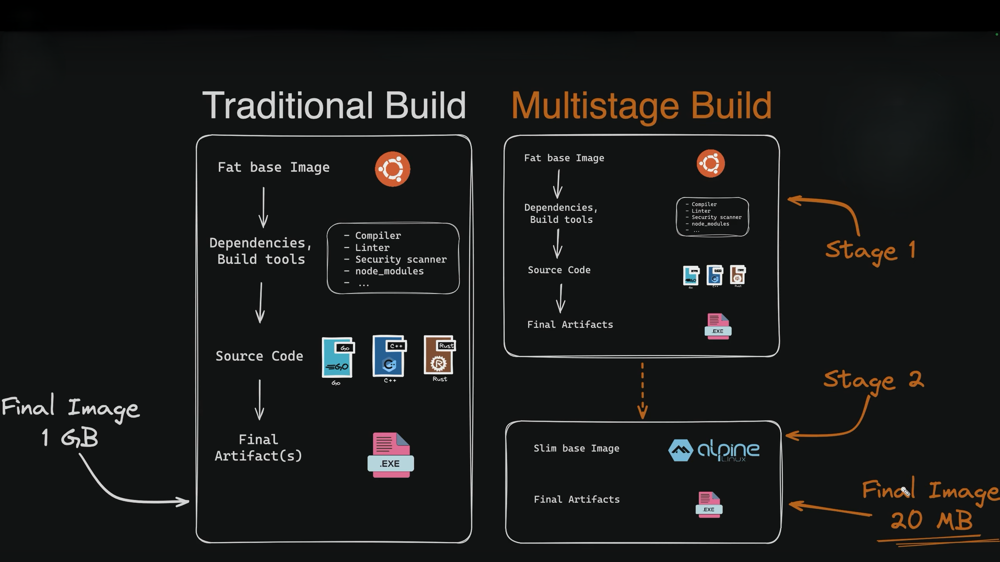 
</div> <br>

## Distroless Images 
- Distroless images are a type of Docker image designed to be minimal and focused solely on running applications. Unlike traditional container images that 
  include a full operating system along with package managers and shells, distroless images contain only the application and its necessary runtime dependencies. 
- This approach offers several advantages, particularly in terms of security and efficiency.
- Key Features of Distroless Images
  
  - Minimalism: <br>
      Distroless images do not include unnecessary components like package managers or shells, which reduces the overall size of the image. 
      For example, the smallest distroless image is around 2 MiB, significantly smaller than typical base images like Debian or Alpine.

  - Enhanced Security: <br>
      By stripping away extraneous components, distroless images minimize the attack surface for potential vulnerabilities. With fewer programs included, 
      there are fewer opportunities for exploitation. Distroless images will lack even simple commands like find, grep, curl etc. which can be exploited by hackers.

  - Simplified Dependency Management: <br>
      These images only contain what is required for the application to function, making it easier to manage dependencies and reducing complexity.

  - OCI Compatibility: <br>
      As of March 2023, distroless images utilize OCI (Open Container Initiative) manifests, ensuring compatibility with modern container tooling.

  - Usage Considerations
    - No Shell Access:  <br>
      Distroless images lack a shell environment, which means that commands typically run in a shell cannot be executed directly. This requires developers to specify 
      entry points in vector form in their Dockerfiles.

    - Multi-Stage Builds:  <br>
      To create a distroless image, developers often use multi-stage builds. This involves compiling the application in one stage and copying the resulting binaries 
      into a distroless base image in another stage.

    - Debugging Challenges:  <br>
      Since distroless images do not provide shell access, debugging can be more complex. However, debug variants of distroless images are available that include 
      minimal shell access for troubleshooting.

  - You can find 'distroless' images below 
    https://github.com/GoogleContainerTools/distroless

<br>
<!-----------------------------------------------------------------------  This is comment   --------------------------------------------------------------------->
<!---------------------------------------------------------------------------------------------------------------------------------------------------------------->

--- 
  # <pre style="padding: 0; margin: 0 0"> <div style="padding: 0 40%">   Day 4 </div>  </pre>
  ## <span style="color: #e1881c"> Why Kubernetes is Used ? </span>
  - Kubernetes is a Container orchestration/managing tool which takes care of following things -
    - Container Networking
    - Resource Management
    - security
    - High availability
    - Fault tolerance
    - Service Discovery
    - Scalability
    - LoadBalancing
    - orchestration

  - However, Kubernetes is not always a solution, especially for small applications which have just 2 to 3 containers. Because to manage 2/3 containers you do not 
    need entire orchestration system. Also, you need lot of admin efforts to manage Kubernetes even though you are using managed kubernetes services like AKS 
    (Microsoft Azure Kubernetes Service), EKS (Amazon Elastic Kubernetes Service), GKE (Google Kubernetes Engine) etc. 

  - Sometimes for smaller applications just using Docker Compose or containers running on bare metal machine or virtual private servers like - a Digital Ocean 
    droplet, or AWS light scale or any image from gcp or azure marketplace can suffice your need with minimum cost, efforts and maintenance. 

<br>
<!-----------------------------------------------------------------------  This is comment   --------------------------------------------------------------------->
<!---------------------------------------------------------------------------------------------------------------------------------------------------------------->

--- 
  # <pre style="padding: 0; margin: 0 0"> <div style="padding: 0 40%">   Day 5 </div>  </pre>
  ## <span style="color: #e1881c"> What is Kubernetes? - Kubernetes Architecture Explained  </span>

    <br> <div style="text-align: center;">
    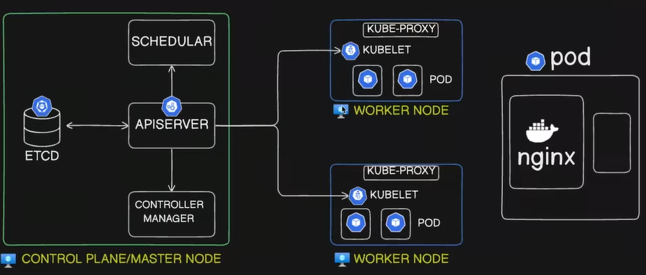 
    </div> <br>

    - Node is a name for virtual machine.
    - In kubernetes, nodes are divided into two groups: control plane nodes (that host administrative components) and worker nodes (that actually run the workload).
    - In high availability production environment, there are multiple nodes for control plane.
    - Worker nodes run the pods. Kubernetes pods encapsulate the containers.
    - Every control node has 4 kubernetes components running on it : Controller manager, Scheduler, ETCD and API-SERVER.
    - Every worker node has 2 kubernetes components running on it  : Kubelet and Kube-proxy running on it.
    - Usually Pods contain only one container but it can sometimes contain more than one containers. These additional containers can be "Helper containers" or 
      "init agents" or "Monitoring agents".

  ## Control Plane components -

    ### 1. API SERVER 
    - It is center of control plane components. Any service coming from outside will come to the API server and it will allocate that request to scheduler, 
      controller manager or ETCD accordingly.

    ### 2. Controller Manager
    - Controller manager is a component which is a combination of different controllers.
      - Node controller
      - Namespace controller
      - deployment controller
    - Controller manager makes sure that all the controllers are running fine and healthy. 
    - It monitors pods, restarts them etc

    ### 3. ETCD
    - It is key-value data store i.e. NO-SQL data store. 
    - Stores data in documents in JSON format.
    - ETCD stores everything about the cluster such as it's state, nodes, pods, secrets etc. Any change made to the cluster will be updated in ETCD database.
    - ETCD will be accessed using API Server.
    - All the control plane components will be available all the time.

  ## Worker Node components -

    ### 1. Kubelet
    - Kubelet receives instructions from control plane node.
    - API Server will send instructions to kubelet to make changes to worker nodes i.e. Pods and kubelet will make those changes and notify the server.

    ### 2. Kube-proxy
    - Kube-proxy enables networking within the node. It allows pods to communicate with each other. 
    - It creates IP table rules for enabling pod to pod networking.

  ## Kubectl
    - User interacts with the kubernetes cluster with the help of kubectl client.
    - Using kubectl, user will send a request to API server which will do following stuff -
      1. First authenticate the request i.e. check whether user has permissions to do the requested task.
      2. Validate the request - check whether the request is valid and is supported by the kubernetes.
      3. Sends that request to the ETCD which then updates the database by creating an entry for a pod and notifies the API server.
      4. 'Scheduler' is monitoring the control plane all the time, it finds that there is a pod which needs to be scheduled on a node. Scheduler checks whether 
          the worker node is available with resources for scheduling a pod or not and notifies the API server with the worker node details.
      5. API server then communicates with the corresponding worker node's 'Kubelet' asking to schedule a pod.
      6. Kubelet will update the API server once the pod has been created.
      7. Now, API server will update the ETCD database that the pod has been created and will notify the user.

<br>
<!-----------------------------------------------------------------------  This is comment   --------------------------------------------------------------------->
<!---------------------------------------------------------------------------------------------------------------------------------------------------------------->

--- 
# <pre style="padding: 0; margin: 0 0"> <div style="padding: 0 40%">   Day 6 </div>  </pre>
## <span style="color: #e1881c"> Kubernetes multi-node Cluster Setup Step by Step - 'Kind' Tutorial </span>

- 'Kind' is a tool,(Long Form - Kubernetes in Docker), for running local Kubernetes cluster using docker containers as nodes. It is most popular local installation of kubernetes.
- Install 'kind' on windows using command - 'choco install kind'
- Why kind?
  - kind supports multi-node (including HA) clusters
  - kind supports building Kubernetes release builds from source
  - support for make/bash or docker, in addition to pre-published builds
  - kind supports Linux, macOS and Windows
  - kind is a CNCF certified conformant Kubernetes installer 

### Creating a Single node Kind cluster
- create a single node cluster with default/latest image :
  ```
    kind create cluster
  ```

- create a single node cluster with an image and the name specified in command line :
  - image details can be found here - https://kind.sigs.k8s.io/docs/user/quick-start#building-images
  ```
    kind create cluster --image kindest/node:v1.31.0@sha256:53df588e04085fd41ae12de0c3fe4c72f7013bba32a20e7325357a1ac94ba865 --name cka-cluster1
  ```

- To delete your cluster use:
  ```
    kind delete cluster
  ```

- To create a cluster from Kubernetes source:
  1. Ensure that Kubernetes is cloned in $(go env GOPATH)/src/k8s.io/kubernetes
  2. Build a node image and create a cluster with
    ```
      kind build node-image 
      kind create cluster --image kindest/node:latest
    ```

### Creating a Multi node Kind cluster
- Configuring Your kind Cluster
  To specify a configuration file when creating a cluster, use the --config flag:
  ```
    kind create cluster --config kind-example-config.yaml
  ```

- Sample of Kind configuration file 
  ```
    # this config file contains all config fields with comments
    # NOTE: this is not a particularly useful config file
    kind: Cluster
    apiVersion: kind.x-k8s.io/v1alpha4
    # patch the generated kubeadm config with some extra settings
    kubeadmConfigPatches:
    - |
      apiVersion: kubelet.config.k8s.io/v1beta1
      kind: KubeletConfiguration
      evictionHard:
        nodefs.available: "0%"
    # patch it further using a JSON 6902 patch
    kubeadmConfigPatchesJSON6902:
    - group: kubeadm.k8s.io
      version: v1beta3
      kind: ClusterConfiguration
      patch: |
        - op: add
          path: /apiServer/certSANs/-
          value: my-hostname
    # 1 control plane node and 3 workers
    nodes:
    # the control plane node config
    - role: control-plane
    # the three workers
    - role: worker
    - role: worker
    - role: worker
  ```

- Multi-node clusters
  In particular, many users may be interested in multi-node clusters. A simple configuration for this can be achieved with the following config file contents:
  - three node (two workers) cluster config
  ```
    kind: Cluster
    apiVersion: kind.x-k8s.io/v1alpha4
    nodes:
    - role: control-plane
    - role: worker
    - role: worker
  ```

- Kind Commands Cheat Sheet
  ```
  1. kind create cluster --name <cluster-name>     :-   Create a cluster
  2. kind get clusters                             :-   List Existing Clusters
  3. kind delete cluster --name <cluster-name>     :-   Delete the Cluster having name 'cluster-name'
  4. kind delete cluster                           :-   If you only have one cluster and it is named "kind," you can simply delete it without 
                                                        specifying the name of the cluster. However, if your cluster has a different name, you 
                                                        must specify it as mentioned above. The command without a specified name defaults to
                                                        "kind," which may lead to confusion if your cluster has a different name.
  5. echo "source <(kind completion bash)" >> ~/.bashrc          :- Enables auto-completion for 'kind' commands in bash permanently.
     (OR)
     source <(kind completion bash)                              :- Enables auto-completion for 'kind' commands in bash for this session.
  6. kind load docker-image <image-name>                         :- Load Docker Image into Kind:
  7. kubectl cluster-info --context kind-<cluster-name>          :- Get Current Context Info
  8. kind create cluster --config <config-file.yaml>             :- Create a Cluster with Config File
  9. kind version                                                :- Check Kind Version
  ```

- Example Config File (cluster-config.yaml) - 1 control node and 3 worker nodes.
  ```
    kind: Cluster
    apiVersion: kind.x-k8s.io/v1alpha4
    networking:
      disableDefaultCNI: false  # Set to true if you want to disable the default CNI
    nodes:
      - role: control-plane
        extraPortMappings:
          - containerPort: 30000
            hostPort: 30000
            protocol: TCP
      - role: worker
      - role: worker
      - role: worker
  ```

- Here is a Quick Reference Guide/ cheat sheet of kubectl commands  
  ```
  https://kubernetes.io/docs/reference/kubectl/quick-reference/ 
  ```

- Following two website are available for reference during the CKA exam 
  ```
  1. https://kubernetes.io/docs 
  2. https://kubernetes.io/blog/ 
  ```


- Run following commands to get more details about the cluster 
  ```
  kubectl cluster-info --context kind-cka-cluster1
  kubectl get nodes
  kubectl config get-contexts
  kubectl config use-context kind-cka-cluster1
  ```

<br>
<!-----------------------------------------------------------------------  This is comment   --------------------------------------------------------------------->
<!---------------------------------------------------------------------------------------------------------------------------------------------------------------->

--- 
# <pre style="padding: 0; margin: 0 0"> <div style="padding: 0 40%">   Day 7 </div>  </pre>
## <span style="color: #e1881c"> Pod in Kubernetes Explained | Imperative Vs Declarative Way | YAML Tutorial  </span>

- Running the workloads on the pods on worker nodes is one of the goal of using kubernetes.
- Pods can be created on worker nodes in two ways:
  1. Imperative  
      a) Starting a Pod using kubectl command.  
      b) Command : kubectl run nginx-pod --image=nginx:latest  
      c) Check the created pod : kubectl get pods  

  2. Declarative  
      a) A configuration file is created using YAML(most common) or JSON containing desired state of object and run 'kubectl create' or 'kubectl apply' command.  
      b) A sample .yaml file

          apiVersion: v1         # For each 'kind', to get its version, run this command - 'kubectl explain pod' command.
          kind: Pod
          metadata:              # Inside 'metadata' or 'spec' we can add only fields that it supports. However, in 'labels' field we can have any key:value pair.
            name: nginx-pod
            labels:
              env: demo              
              type: frontend
          spec:
            containers: 
            - name: nginx-container
              image: nginx
              ports:
              - containerPort: 80  
      c) Execute following commands -  
      ```
      - kubectl create -f pod_config.yaml                                       # Create a pod as specified in the configuration file 'pod_config.yaml'
        (OR)
        kubectl apply -f pod_config.yaml                                        # Apply the configuration in file 'pod_config.yaml' to the running pod and if pod is not 
                                                                                  there then create it.
      - kubectl get pods
      - kubectl describe pod nginx-pod                                          # command to check the status of the pod.
      - kubectl edit pod nginx-pod                                              # Directly edit the running pod configuration  
      - kubectl exec -it nginx-pod -- sh                                        # Launch 'sh' shell on pod named 'nginx-pod'
      - kubectl run nginx --image=nginx --dry-run=client                        # Dry run but do not launch the pod with name 'nginx' and image 'nginx'
      - kubectl run nginx --image=nginx --dry-run=client  -o yaml > pod.yaml    # Dry run the specified configuration and output to 'pod.yaml' file in yaml format.
      - kubectl run nginx --image=nginx --dry-run=client  -o json > pod.json    # Dry run the specified configuration and output to 'pod.json' file in json format.
      - kubectl describe pod nginx-pod                                          # Getting all the details about the pod named 'nginx-pod'
      - kubectl get pods nginx-pod --show-labels                                # Get details of the labels associated with the pod named 'nginx-pod'
      - kubectl get pods -o wide                                                # Gives the information about the pods in little more detail. Such as the IP address
                                                                                  where the pod is running.
      ```

<br>
<!-----------------------------------------------------------------------  This is comment   --------------------------------------------------------------------->
<!---------------------------------------------------------------------------------------------------------------------------------------------------------------->

--- 
# <pre style="padding: 0; margin: 0 0"> <div style="padding: 0 40%">   Day 8 </div>  </pre>
## <span style="color: #e1881c"> Kubernetes Deployment, Replication Controller and ReplicaSet Explained </span> 

<br> <div style="text-align: center;">
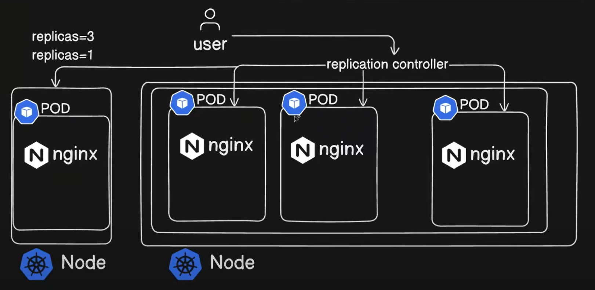 
</div> <br>

### Replication Controller
  - creates new pods, maintains the specified replicas of the pods. It spins out identical instances of the pod.
  - In kubernetes, control manager makes sure that the kubernetes resources are always up and running. There are controllers for each kind such as Pods, 
    ReplicaSet, Node, namespace, networks etc.
  - Replication controller has the load balancing logic/algorithms to forward the application requests to the respective nodes.
  - Replication controller can also manages or spin out the pods on another node if the current node resources are already occupied.

### ReplicaSet
  - The difference between the replication controller and the replicaSet is that replication controller can control only the pods that were created
    using the replication controller and not others. But replicaSet can manage existing pods that were not part of the replicaSet using the 'selector' field.

- Increasing or decreasing the replicas can be done in 2 ways :-
  - a) by making changes to the config file and applying those changes using command - 'kubectl apply -f config.yaml'
  - b) by editing the running object directly - kubectl edit rs/nginx-rs
  - c) by issuing command imperative way - kubectl scale --replicas=10 rs/nginx-rs

### Deployment
  - Deployment is an encapsulation over replicaSet. Deployment provide one additional functionality for the pods inside replicaSet. Usually, when apply changes to 
    the replicaSet config file, the changes are applied at once to all the pods in ReplicaSet. This will lead to the downtime of the cluster for a short period of 
    time.
  - However, deployment will make sure that the changes are applied to Pods in rotation, it also handles the traffic while updating these pods and avoids the 
    downtime of the cluster.
  ```
  - kubectl set image deploy/nginx-deploy nginx=nginx:1.9.1   :-  Change the image that is being used in the deployment 'nginx-deply' to nginx:1.9.1
  - kubectl rollout history deploy/nginx-deploy               :-  This command provides a summary of the deployment's revision history, including the revision
                                                                  number and any associated change causes. 
  - kubectl rollout history deployment/nginx-deploy --revision=2 
                                                              :-  If you want to see more details about a particular revision, you can specify it with the 
                                                                  --revision flag
  - kubectl rollout undo deployment/nginx-deploy --to-revision=2
                                                              :-  If you find that a recent change has caused issues, you can rollback to a previous revision 2.
                                                              
  - kubectl rollout status deployment/nginx-deploy            :-  After executing 'kubectl rollout' command, check the status of the rollout with 'rollout status' 
                                                                  command.
  - kubectl create deploy deploy/nginx-new --image=nginx  --dry-run=client -o yaml
                                                              :- Output a yaml format config file for creating a new deployment with name 'nginx-new' and image 'nginx'
  ```
<br>
<!-----------------------------------------------------------------------  This is comment   --------------------------------------------------------------------->
<!---------------------------------------------------------------------------------------------------------------------------------------------------------------->

---
# <pre style="padding: 0; margin: 0 0"> <div style="padding: 0 40%">   Day 9 </div>  </pre>
## <span style="color: #e1881c"> Kubernetes Services  </span>

  - Services enable communication between the kubernetes pods even if their IP address change.
  - 'Services' can be of following types
    1. ClusterIP 
    2. NodePort 
    3. LoadBalancer 
    4. ExternalName 
  
###  1. NodePort Service 
  - This 'NodePort' services are used to expose the services provided at internal port of the specified pods to the external Users.
  
  - The config file of 'NodePort' service should specify following 3 ports in it -  
    - NodePort  
      This is the port on which application will be exposed to external users. The range for the ports is from 30000 to 32767. 

    - Port  
      This is the port on which service will be exposed internally in the cluster. That is other pods in the cluster will be accessing 
      a given pods service using this port.

    - TargetPort  
      This is the port on which application pod will be listening. Target port will not be exposed externally.

  <br> <div style="text-align: center;">
  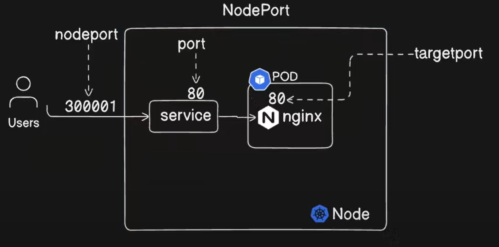 
  </div> <br>

  - Services will also work with the multiple pods running on the same node or with the multiple pods running on different nodes.  

  <br> <div style="text-align: center;">
  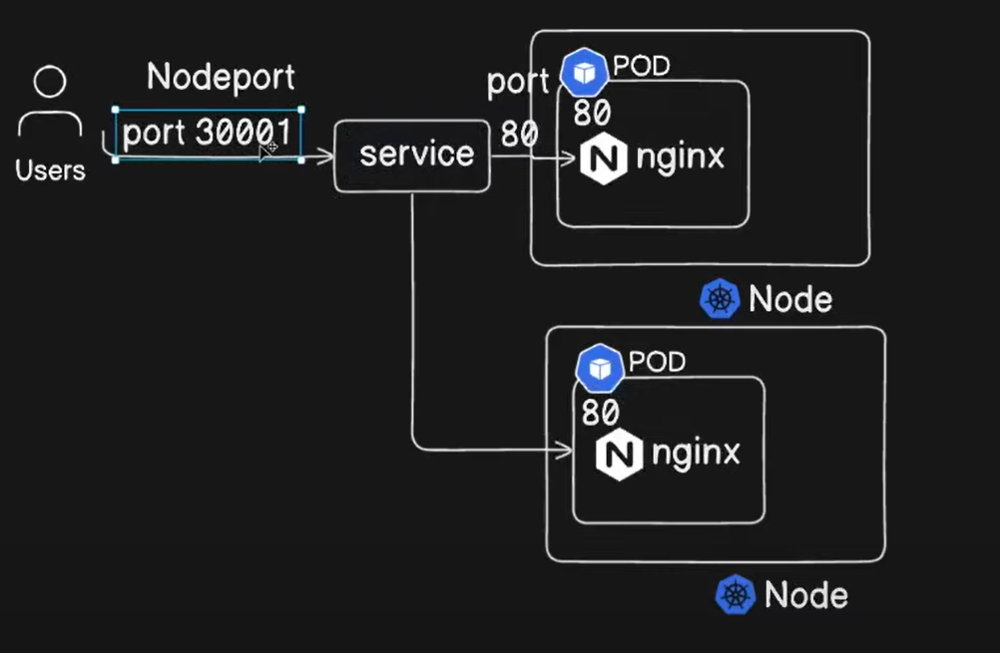 
  </div> <br>

  - In 'kind' clusters, ports are not exposed to outside world. You need to explicitly expose the services in the configuration files.
  
    ```
    kind: Cluster
    apiVersion: kind.x-k8s.io/v1alpha4
    networking:
      disableDefaultCNI: false  # Set to true if you want to disable the default CNI
    nodes:
      - role: control-plane
        extraPortMappings:
          - containerPort: 30001
            hostPort: 30001
            protocol: TCP
      - role: worker
      - role: worker
      - role: worker
    ```
###  2. ClusterIP Service 
  - To enable pods to communicate with each other, the service of type 'ClusterIP' is created. For example using 'ClusterIP' services, 
    the pods running frontend can communicate with the pods running backend or with the pods running database server;
  - 'ClusterIP' service is internal to the cluster so it does not have external IP.
  - Endpoints of a Service  
    The 'Endpoints' of a service are the IP addresses of the Pods on which the given service is listening to.

###  3. LoadBalancer Service
  - In kubernetes, every Pod has an IP address and that IP address changes each time the pod is relaunched.
  - So, in kubernetes we do not access pods using their IP addresses. Instead, we create services 
  - If an app is served to users with the help of multiple pods, then the users instead of accessing the pods separately will just 
    reach out to the 'LoadBalancer' service which will redirect that request to the available pod.

  <br> <div style="text-align: center;">
  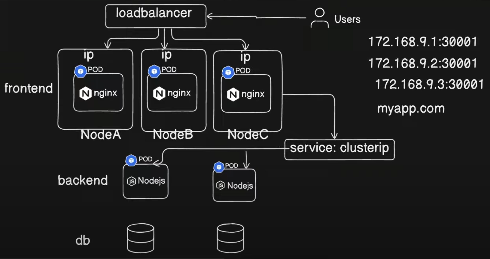 
  </div> <br>

  - Though the following code will create a load balancer service, it will not be assigned with 'External IP' address, as we have not 
    made a provision for a load balancer. You can follow the 'kind' tutorial for provisioning the load balancer using go language.

    ```
      # configuration for creating a service
      apiVersion: v1            # kubectl explain service
      kind: Service
      metadata:
        name: loadbalancer-svc
        labels:
          env: demo
      spec:
        type: LoadBalancer   
        ports:
        - port: 80            # We do not need 'NodePort' for 'LoadBalancer' service
          targetPort: 80
        selector:
          env: demo
    ```

### 4. ExternalName Service
  - This 'ExternalName' type of service is used to map a pod to the DNS. 
  - Using this service, internal services can refer to the DNS of your application.
  - Example config file -
  
    ```
      apiVersion: v1  
      kind: Service  
      metadata:
        name: my-service
        namespace: prod 
      spec:
        type: ExternalName
        externalName: my.database.example.com
    ```  

- You can also create a service using imperative way i.e. by directly using a single command 
  ```
    # Create a service for a replicated nginx, which serves on port 80 and connects to the containers on port 8000
    kubectl expose rc nginx --port=80 --targetPort=8000 

    # In the same way as above, we can create a service for a deployment.
    kubectl expose deploy/nginx-deploy --port=80 --targetPort=8000
  ```

<!-----------------------------------------------------------------------  This is comment   --------------------------------------------------------------------->
<!---------------------------------------------------------------------------------------------------------------------------------------------------------------->

---
# <pre style="padding: 0; margin: 0 0"> <div style="padding: 0 40%">   Day 10 </div>  </pre>
##  <span style="color: #e1881c"> Kubernetes Namespace </span>
## [Kubernetes Namespaces and Contexts](https://www.youtube.com/watch?v=2h6TAJirDqI)

- 'Namespace' gives another level of isolation so that you can separate the objects and resources within a cluster using different methods.
- When you create a resource and do not specify the namespace explicitly then it will get created in 'default' namespace.
- In Kubernetes, two different resources cannot have the same name within the same namespace. However, they can share the same name if they are located in different namespaces.
- Kubernetes also creates some of the namespaces by default such as 'kube-system' which is used for hosting control plane components by default.
- Different namespaces can be given different access permissions. Usually, separate namespaces are created for development, test and production environment.
- Fully Qualified Domain Name  
  The pods in the same name space can easily communicate with each other using hostname but pods across different namespaces can not communicate directly 
  with each other for that purpose we use fqdn (Fully Qualified Domain Name). 
- Below is a sample .yaml file for creating a Kubernetes namespace
  ```
    apiVersion: v1  
    kind: Namespace
    metadata:
      name: demo-namespace
  ```

- Create a namespace using command in imperative way (i.e. using command line) 
  ```  
  kubectl create ns demo
  ```

- Creating a deployment in 'demo' namespace
  ```
    kubectl create deployment mongo-depl --image=mongo -n demo    :-  Creates mongoDb deployment with name 'mongo-depl' and image 'mongo' as specified in 
                                                                      namespace named 'demo'  

    kubectl get pods -n demo                                      :-  Gets pods from namespace 'demo'
  ```

- IP addresses of the Pods are cluster wide that is an IP address from one namespace can be accessed from another namespace. This means that we can 
  communicate across the pods using their IP addresses however, IP addresses of the pods are not static they can change over time if relaunched. 

- Services from one namespace can not be accessed directly from another namespace, unless 'Fully Qualified Domain Names' as per the entry from 
  'etc/resolv.conf' are used.

- Kubectl commands to set the namespace context for the subsequent commands 
  ```
      - kubectl config set-context --current --namespace=<desired-namespace>
                                                                  :-  Set the namespace to 'desired-namespace' for all the subsequent commands.
        e.g. - kubectl config set-context --current --namespace=default

      -  kubectl config view --minify | grep namespace            :-  To confirm that the namespace has been set correctly, you can check your current context.
  ```
- Issue following command in two different terminals
  
- Terminal 1 - 'default' namespace 
  ```
    kubectl create ns demo
    kubectl create deploy nginx-depl --image=nginx
    kubectl scale deploy nginx-demo --replicas=3 
    kubectl expose deploy nginx-depl --port=80 --name=svc-default
    kubectl get pods -n default -o wide
    kubectl exec -it nginx-depl-56d5cff9d7-hhbdk -- sh
    curl svc-demo
    cat /etc/resolv.conf
    curl svc-demo.demo.svc.cluster.local
  ```

- Terminal 2 - 'demo' namespace
  ```
    kubectl create deployment nginx-demo --image=nginx -n demo
    kubectl scale deploy nginx-demo --replicas=3 -n demo
    kubectl get pods -n demo
    kubectl expose deploy nginx-demo --port=80 --name=svc-demo -n demo
    kubectl get pods -n default -o wide
    kubectl exec -it nginx-demo-cccbdc67f-92sfp -n demo -- sh 
    curl svc-default
    cat /etc/resolv.conf
    curl svc-default.default.svc.cluster.local
  ```

  <br> <div style="text-align: center;">
  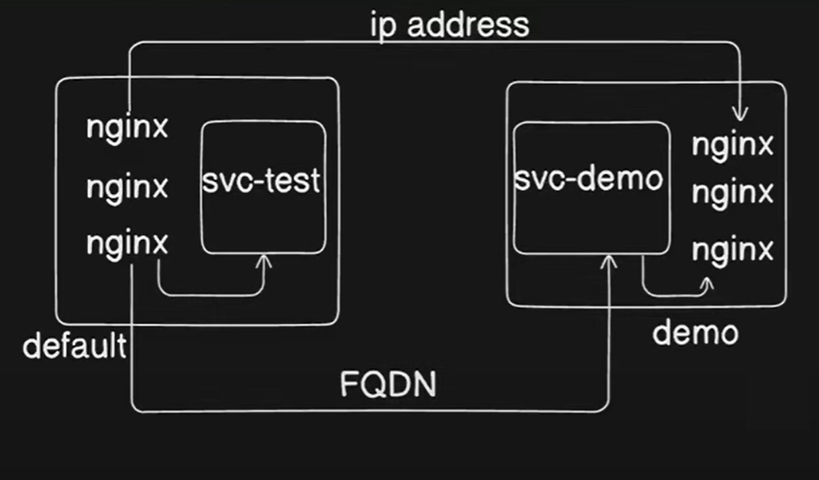 
  </div> <br>

##  Kubernetes Context
- **Definition**  
  A context in Kubernetes is a configuration that defines access parameters for interacting with a specific cluster.

- It combines three key elements:  
  1. **Cluster**  
    The Kubernetes cluster you want to connect to.

  2. **User**  
    The user credentials used to authenticate against the cluster.

  3. **Namespace**  
    The default namespace for operations executed in that context (optional).

- **Purpose**    
  Contexts simplify the management of multiple clusters and user configurations by allowing users to switch between them easily without re-entering connection details. For example, if you have different clusters for development, testing, and production, you can create separate contexts for each.
  
- **Usage**  
  You can view and switch contexts using commands like:
  ```
    kubectl config get-contexts                 # Lists all available contexts.
    kubectl config use-context <context-name>   # Switches to the specified context.
  ```

##  Kubernetes Namespace
- **Definition**  
  A namespace is a logical partition within a single Kubernetes cluster that allows for resource isolation. It acts as a virtual cluster within the physical cluster.

- **Purpose**      
  Namespaces help organize resources and manage access control. They allow multiple teams or projects to coexist within the same cluster without interfering with each other. 
  Each namespace can contain its own set of resources, such as pods, services, and deployments.

- **Usage**  
  You can specify a namespace when executing commands or set a default namespace for a context. For example:
  ```
    kubectl get pods --namespace=<namespace>    # Retrieves pods from the specified namespace.
  ```

- If a context is set with a 'default' namespace, commands executed under that context will operate within that namespace unless another is specified.

<br>
<!-----------------------------------------------------------------------  This is comment   --------------------------------------------------------------------->
<!---------------------------------------------------------------------------------------------------------------------------------------------------------------->

---  
# <pre style="padding: 0; margin: 0 0"> <div style="padding: 0 40%">   Day 11 </div>  </pre>
## <span style="color: #e1881c"> Multi-container Pods in Kubernetes </span>

- Along with the main container that is running inside a pod, there can be other supporting containers. 
- These supporting containers can be of two types
  
  ### 1. Init Containers  
    - These containers run before the main app container and do certain tasks.
  
    - Whenever kubelet receives a request to start a pod, it will start first 'init' container and when it finishes its work app container will start.

    - For the main app container to start all the init containers must be initialized first.

    - Sequential Execution:  
      Init containers run sequentially in the order they are defined in the Pod specification.   
      Each init container must complete successfully before the next one starts.   
      If an init container fails, Kubernetes will keep retrying it according to the Pod's restartPolicy until it succeeds or the Pod fails entirely

    - Command Execution:  
      The command specified for an init container is executed in a shell (e.g., sh -c).  
      This means that the command will run and must finish successfully for the init container to be considered "initialized" or "completed."  
      The init container is not considered initialized until its command has finished executing with a successful exit code (typically 0).

  ### 2. Sidecar/Helper Containers 
    - These containers run all the time along with the app container and provide certain input or get the output from the app container.
    
- When app container dies, Init/Sidecar container will also be stopped/deleted.
- Both app container and Init/Sidecar container, or to be precise all the containers inside a pod, will share the resources of the pod.
- Sample .yaml file 
  ```
    apiVersion: v1
    kind: Pod
    metadata: 
      name: app
      labels:
        name: myapp-pod
    spec:
      containers:
      - name: myapp-container
        image: busybox:1.28
        command: ['sh', '-c', 'echo The app is running && sleep 3600']
        env:
        - name: FIRSTNAME
          value: rakesh
      initContainers: 
      - name: init-myservice
        image: busybox:1.28
        command: ['sh', '-c'] 
        args: ['until nslookup myservice.default.svc.cluster.local; do echo waiting for service to be up; sleep 2; done']
      - name: init-mydb
        image: busybox:1.28
        command: ['sh', '-c'] 
        args: ['until nslookup mydb.default.svc.cluster.local; do echo waiting for service to be up; sleep 2; done']
  ```

### nslookup command 
- The 'nslookup' command is a network administration tool used for querying the Domain Name System (DNS) to obtain domain name or IP address mapping information. 
- It helps to troubleshoot DNS-related issues by providing details about DNS records associated with a domain or IP address.

  ```
    nslookup [options] [domain] [server]

    options : Modifiers that change the behavior of the command (e.g., -type to specify record types).
    domain  : The domain name or IP address you want to query.
    server  : (Optional) A specific DNS server to use for the query.
  ```

- For example,
  ```
    Command :-
      nslookup google.com

    Output  :-
      Server  :  8.8.8.8
      Address :  8.8.8.8#53

      Non-authoritative answer:
      Name    : google.com
      Address : 172.217.14.206

      Server                    : Indicates that Google's public DNS server at 8.8.8.8 was used.
      Non-authoritative answer  : Means that the response is from a cache rather than directly from Google's authoritative DNS server.
      Name and Address          : Show that google.com resolves to the IP address 172.217.14.206.
  ```

<br>
<!-----------------------------------------------------------------------  This is comment   --------------------------------------------------------------------->
<!---------------------------------------------------------------------------------------------------------------------------------------------------------------->

---
# <pre style="padding: 0; margin: 0 0"> <div style="padding: 0 40%">   Day 12 </div>  </pre>
## <span style="color: #e1881c"> Kubernetes Daemonsets, Job and Cronjob in Kubernetes </span> 

- When we specify the replicas=3, then Kubernetes will create 3 pods in total across all the nodes whereas in case of Daemonsets, there will be only one 
  replica per node i.e. Daemonset makes sure that there is at the least and at the most one specified pod per node.
- Whenever a new node is added to the cluster, a replica of the Daemonset, short cut is DS, is created and as soon as the node is deleted the replica will also be  
  deleted.
- Daemonsets are used in case of monitoring, logging agents, control plane components such as kube-proxy, network CNIs(Container Network Interface) agents such as  
  weave-net, flannel and calico as these agents need to run on all the nodes all the time. (CNIs enable communication between the pods.)

## Cronjob

- Used to run/execute some tasks periodically.
- Used for generating daily/weekly/monthly reports or running cleanup jobs.
- Syntax consists of 5 stars (* * * * *) which specify 
  ```
    1. Minute       :- (0 to 59)    :- */5: Every 5 minutes, */10: Every 10 minutes
    2. Hour         :- (0 to 23)    :- */1: Every 1 hour, */2: Every 2 hours, */3: Every 3 hours etc
    3. Day of Month :- (1 to 31) 
    4. Month        :- (1 to 12)
    5. Day of Week  :- (0-Sunday to 6-Saturday)
  ```

  ```
    apiVersion: batch/v1 
    kind: CronJob
    metadata:
      name: hello  
    spec:
      schedule: "* * * * *"
      jobTemplate:
        spec:
          template:
            spec:
              containers:
              - name: hello  
                image: busybox:1.28  
                command: ["/bin/sh", "-c", "date; echo Hello from the Kubernetes Cluster"]
              restartPolicy: OnFailure
  ```

## Job  

- CronJob are supposed to execute some tasks periodically whereas Job executes the task only once.
- They are mostly part of installation scripts or automation pipelines while provisioning a new cluster.

  ```
    apiVersion: batch/v1 
    kind: Job
    metadata:
      name: pi  
    spec:
      template:
        spec:
          containers:
          - name: pi  
            image: perl  
            command: ["perl", "-Mbignum=bpi", "-wle", "print bpi(2000)"]
          restartPolicy: Never
      backoffLimit: 4
  ```  

<br>
<!-----------------------------------------------------------------------  This is comment   --------------------------------------------------------------------->
<!---------------------------------------------------------------------------------------------------------------------------------------------------------------->

---
# <pre style="padding: 0; margin: 0 0"> <div style="padding: 0 40%">   Day 13 </div>  </pre>
## <span style="color: #e1881c"> Static Pods, Manual scheduling, Labels and Selectors in Kubernetes </span>

- Scheduler is responsible for scheduling the pods however the 'scheduler' itself is a pod. Then who is responsible for scheduling of the 'scheduler' pod ?
- Actually, the scheduler is a control plane component and is of type 'static' pod. 
- Static Pods are scheduled by 'kubelet'. 
- The specification details of all the static pods are stored in '/etc/kubernetes/manifests/' directory in .yaml files, which is continuously monitored by the   
  kubelet to apply any changes made to the specification of the static pods. 
- ** Manual scheduling **  
  Pods can be scheduled manually on a specific node by specifying the node name in selector 'nodeName: <some-worker-node-name>'. 
- 'Scheduler' keeps on scanning the pods in pending state, which do not have the selector 'nodeName: <some-worker-node-name>' and schedules them to some 
  worker node.

  ```
    apiVersion: v1
    kind: Pod
    metadata:
      labels:
        run: nginx-new1
      name: nginx-new1
    spec:
      containers:
      - image: nginx
        name: nginx-new1
        resources: {}
      nodeName: cka-cluster-worker2
      dnsPolicy: ClusterFirst
      restartPolicy: Always
  ``` 
- Labels are specified in the 'metadata' field of the .yaml file and is helpful in filtering that resource. That resource can be deployment, pod, daemonset etc.
- Selector will match the labels of the 'Pod' to include them into the aggregating resource such as 'deployment', 'daemonset' etc.
  ```
    kubernetes get pods --selector run=nginx-new1         # Filtering pods based on the label 'run: nginx-new1' from the current namespace.
  ```
- The config file of a pod, which we can by command 'kubectl edit pod <pod-name>' also contain a filed 'annotations' which is bit similar to the labels but is 
  used to store the metadata of that resource.
- 'namespaces' logically separate the resources, whereas 'labels' are used for tagging the resources.

<br>
<!-----------------------------------------------------------------------  This is comment   --------------------------------------------------------------------->
<!---------------------------------------------------------------------------------------------------------------------------------------------------------------->

--- 
# <pre style="padding: 0; margin: 0 0"> <div style="padding: 0 40%">   Day 14 </div>  </pre>
## <span style="color: #e1881c"> Taints and Tolerations in Kubernetes </span>

- Nodes are assigned a 'key=value' pair which is called as 'Taint' whereas the Pods are assigned a 'key=value' pair which is known as 'Toleration'.
- The pods are allotted to the node whose 'Taint' satisfies the condition specified by the 'Toleration' of the Pod.
- Node affinity is a property of Pods that attracts them to a set of nodes (either as a preference or a hard requirement). 
- Taints are the opposite -- they allow a node to repel a set of pods.
- But it is important to note that the pods with toleration can be assigned to the nodes that do not have any taints.
- Tolerations are applied to pods. Tolerations allow the scheduler to schedule pods with matching taints. 
- Tolerations allow scheduling, but don't guarantee scheduling: the scheduler also evaluates other parameters as a part of its function.

  <br> <div style="text-align: center;">
  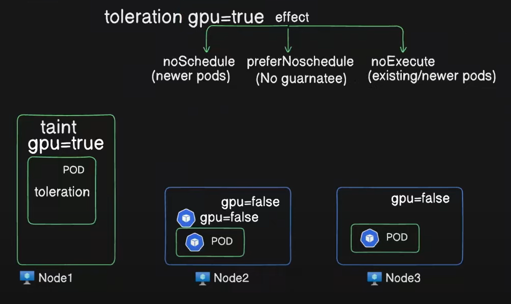 
  </div> <br>

- Taints and Tolerations work together to ensure that pods are not scheduled onto inappropriate nodes. 

- One or more taints are applied to a node; this marks that the node should not accept any pods that do not tolerate the taints

- 'Toleration' also has one field named 'Effect' which specifies the scheduling type, which can be one of the 3 types  

  1. NoExecute  
    This affects pods that are already running on the node as follows:
      - Pods that do not tolerate the taint are evicted immediately
      - Pods that tolerate the taint will be kept running on node for the time depending on value of 'tolerationSeconds' field
        1. If 'tolerationSeconds' is not specified then Pod in their toleration specification remain bound forever.
        2. Pods that tolerate the taint with a specified 'tolerationSeconds' remain bound for the specified amount of time. After that time elapses, 
            the node lifecycle controller evicts the Pods from the node.

  2. NoSchedule  
    No new Pods will be scheduled on the tainted node unless they have a matching toleration. Pods currently running on the node are not evicted.

  3. PreferNoSchedule  
    PreferNoSchedule is a "preference" or "soft" version of NoSchedule. The control plane will try to avoid placing a Pod that does not tolerate 
    the taint on the node, but it is not guaranteed. Pods currently running on the node are not evicted.

    ```
      apiVersion: v1
      kind: Pod
      metadata:
        name: nginx3
        label: 
          demo: app
      spec:
        containers:
        - image: redis
          name: redis
        tolerations:
          - key: "gpu"
            operator: "Equal"
            value: "true"
            effect: "NoExecute"
    ```

- nodeSelector  
  These 'key:value' fields are specified in Pod's '.yaml' file, which make sure that the pod is scheduled on the node which has the labels as specified in the
  'nodeSelector' field.

  ```
    apiVersion: v1
    kind: Pod
    metadata:
      name: nginx
    spec:
      containers:
      - name: nginx
        image: nginx
      nodeSelector:
        disktype: ssd
        environment: production
  ```

<br>
<!-----------------------------------------------------------------------  This is comment   --------------------------------------------------------------------->
<!---------------------------------------------------------------------------------------------------------------------------------------------------------------->
---

# <pre style="padding: 0; margin: 0 0"> <div style="padding: 0 40%">   Day 15 </div>  </pre>
## <span style="color: #e1881c"> Kubernetes Node Affinity  </span>

- With taints and tolerations we can not add multiple conditions but with affinity we can specify multiple conditions.
  
- Pods are scheduled by matching the pod affinity criteria with the node labels.
  e.g.  
      affinity disk != ssd   
      affinity disk = ssd   
      affinity disk in(ssd, hdd)   

- The following two policies will specify the behavior of scheduler when the pods are scheduled and when the pods are already running and the node labels 
  are changed.

  1. requiredDuringSchedulingIgnoredDuringExecution  
      'requiredDuringScheduling' means the nodes must satisfy the affinity conditions in order to run the pod on it. 'IgnoredDuringExecution' means if the pod 
      is executing and there is a change in the node label or anything else, it will not impact the existing pods.

  2. preferredDuringSchedulingIgnoredDuringExecution  
      The matching of the labels is preferred but if no node matches the affinity conditions then the pod will not keep on waiting but will be scheduled on one
      of the nodes.  
      This option is used when we want to schedule the pod irrespective of the label is matched or not.

- Tolerations on the pod can not prevent them from being scheduled on the node that does not have any taints. However, this can be achieved by the use of node labels
  and affinity.

- Combination of the Taints and the affinity can be used to schedule the pods on appropriate nodes.
  
  <br> <div style="text-align: center;">
  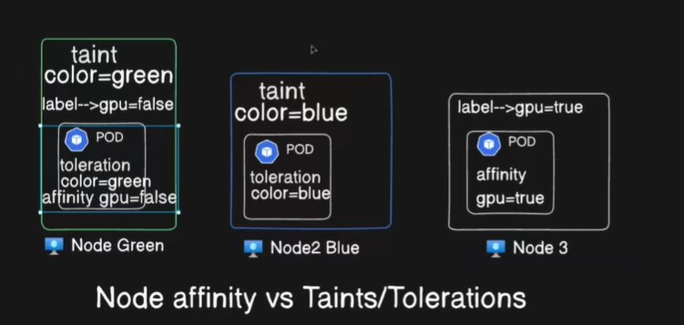 
  </div> <br>

<br>
<!-----------------------------------------------------------------------  This is comment   --------------------------------------------------------------------->
<!---------------------------------------------------------------------------------------------------------------------------------------------------------------->

---
# <pre style="padding: 0; margin: 0 0"> <div style="padding: 0 40%">   Day 16 </div>  </pre>

## <span style="color: #e1881c"> Kubernetes Requests and Limits  </span>
  
  <br> <div style="text-align: center;">
  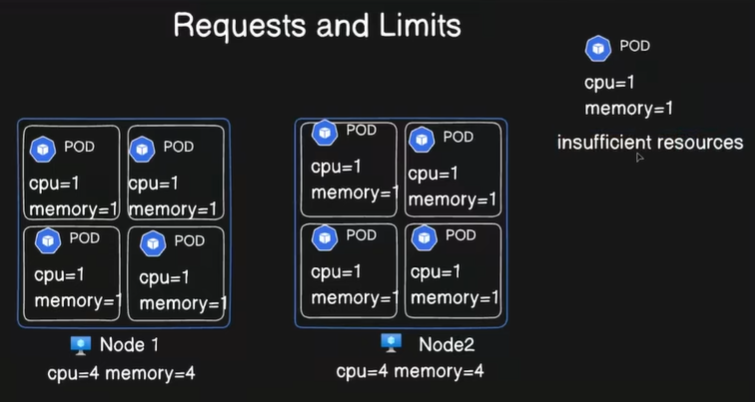 
  </div> <br>

- The Pod can specify the limits on the memory and cpu usage in its specification. CPU usage limits are specified in terms of 100m where 'm' stands for 
  millicore i.e. 100m stands for 0.1 of a CPU core and 1000m stands for one cpu core.
  
- If cpu and memory limits are not specified and the Pod tries to access the resources more than that the node can provide, it gets crashed with the error 
  OOM (i.e. Out of memory error). Sometimes 'Node' can also get crashed because of the Pod requesting more resources that it can handle.

- When we specify the memory and cpu limits in the Pod then the pod will be killed if it tries to use more resources than the limit specified in the specs.
  
- metrics-server will exposes the metrics of the node such as cpu, memory utilization which can be utilized by scaling processes to scale the pods.
  
- Use the following metrics-server.yaml file to expose the metrics of the node  
    <details> <summary> <span style="font-weight: bold; color: green; bold"> Click here for the contents of the metrics-server.yaml file </summary>

  ```
    apiVersion: v1
    kind: ServiceAccount
    metadata:
      labels:
        k8s-app: metrics-server
      name: metrics-server
      namespace: kube-system

    ---
    apiVersion: rbac.authorization.k8s.io/v1
    kind: ClusterRole
    metadata:
      labels:
        k8s-app: metrics-server
        rbac.authorization.k8s.io/aggregate-to-admin: "true"
        rbac.authorization.k8s.io/aggregate-to-edit: "true"
        rbac.authorization.k8s.io/aggregate-to-view: "true"
      name: system:aggregated-metrics-reader
    rules:
    - apiGroups:
      - metrics.k8s.io
      resources:
      - pods
      - nodes
      verbs:
      - get
      - list
      - watch

    ---
    apiVersion: rbac.authorization.k8s.io/v1
    kind: ClusterRole
    metadata:
      labels:
        k8s-app: metrics-server
      name: system:metrics-server
    rules:
    - apiGroups:
      - ""
      resources:
      - nodes/metrics
      verbs:
      - get
    - apiGroups:
      - ""
      resources:
      - pods
      - nodes
      verbs:
      - get
      - list
      - watch

    ---
    apiVersion: rbac.authorization.k8s.io/v1
    kind: RoleBinding
    metadata:
      labels:
        k8s-app: metrics-server
      name: metrics-server-auth-reader
      namespace: kube-system
    roleRef:
      apiGroup: rbac.authorization.k8s.io
      kind: Role
      name: extension-apiserver-authentication-reader
    subjects:
    - kind: ServiceAccount
      name: metrics-server
      namespace: kube-system

    ---
    apiVersion: rbac.authorization.k8s.io/v1
    kind: ClusterRoleBinding
    metadata:
      labels:
        k8s-app: metrics-server
      name: metrics-server:system:auth-delegator
    roleRef:
      apiGroup: rbac.authorization.k8s.io
      kind: ClusterRole
      name: system:auth-delegator
    subjects:
    - kind: ServiceAccount
      name: metrics-server
      namespace: kube-system

    ---
    apiVersion: rbac.authorization.k8s.io/v1
    kind: ClusterRoleBinding
    metadata:
      labels:
        k8s-app: metrics-server
      name: system:metrics-server
    roleRef:
      apiGroup: rbac.authorization.k8s.io
      kind: ClusterRole
      name: system:metrics-server
    subjects:
    - kind: ServiceAccount
      name: metrics-server
      namespace: kube-system

    ---
    apiVersion: v1
    kind: Service
    metadata:
      labels:
        k8s-app: metrics-server
      name: metrics-server
      namespace: kube-system
    spec:
      ports:
      - name: https
        port: 443
        protocol: TCP
        targetPort: https
      selector:
        k8s-app: metrics-server

    ---
    apiVersion: apps/v1
    kind: Deployment
    metadata:
      labels:
        k8s-app: metrics-server
      name: metrics-server
      namespace: kube-system
    spec:
      selector:
        matchLabels:
          k8s-app: metrics-server
      strategy:
        rollingUpdate:
          maxUnavailable: 0
      template:
        metadata:
          labels:
            k8s-app: metrics-server
        spec:
          containers:
          - args:
            - --cert-dir=/tmp
            - --secure-port=10250
            - --kubelet-preferred-address-types=InternalIP,ExternalIP,Hostname
            - --kubelet-use-node-status-port
            - --kubelet-insecure-tls
            - --metric-resolution=15s
            image: registry.k8s.io/metrics-server/metrics-server:v0.7.1
            imagePullPolicy: IfNotPresent
            livenessProbe:
              failureThreshold: 3
              httpGet:
                path: /livez
                port: https
                scheme: HTTPS
              periodSeconds: 10
            name: metrics-server
            ports:
            - containerPort: 10250
              name: https
              protocol: TCP
            readinessProbe:
              failureThreshold: 3
              httpGet:
                path: /readyz
                port: https
                scheme: HTTPS
              initialDelaySeconds: 20
              periodSeconds: 10
            resources:
              requests:
                cpu: 100m
                memory: 200Mi
            securityContext:
              allowPrivilegeEscalation: false
              capabilities:
                drop:
                - ALL
              readOnlyRootFilesystem: true
              runAsNonRoot: true
              runAsUser: 1000
              seccompProfile:
                type: RuntimeDefault
            volumeMounts:
            - mountPath: /tmp
              name: tmp-dir
          nodeSelector:
            kubernetes.io/os: linux
          priorityClassName: system-cluster-critical
          serviceAccountName: metrics-server
          volumes:
          - emptyDir: {}
            name: tmp-dir

    ---
    apiVersion: apiregistration.k8s.io/v1
    kind: APIService
    metadata:
      labels:
        k8s-app: metrics-server
      name: v1beta1.metrics.k8s.io
    spec:
      group: metrics.k8s.io
      groupPriorityMinimum: 100
      insecureSkipTLSVerify: true
      service:
        name: metrics-server
        namespace: kube-system
      version: v1beta1
      versionPriority: 100
  ```
<br>

- Command to get the resource usage of each node 
  
  ```
    kubectl top nodes                     # Show metrics for all nodes.
    kubectl top nodes node_name           # Show metrics for a specific node. 

    kubectl top nodes -l,
    (OR) kubectl top nodes --selector     # Filter nodes based on specific labels.

    kubectl top nodes --show-capacity     # Display node resources based on capacity instead of allocatable resources.
    kubectl top nodes --sort-by           # Sort the output by a specified field, either 'cpu' or 'memory'.
    kubectl top nodes --no-headers        # Suppress headers in the output.
  ```

- Resource limits need to be specified inside the container as specified below. The memory limit of '200Mi' means that if the pod 
  starts utilizing memory more than 200Mi, it will be killed. If the 'limits' are not specified then the pod can keep on using 
  whatever resources it needs, which might lead to the crashing of the node itself.    

- 'requests.memory' specifies lower bound on the memory use, whereas 'limits.memory' specifies upper bound on the memory use.

  ```
    apiVersion: v1
    kind: Pod
    metadata:
      name: redis2
      labels:
        app: demo
    spec:
      containers:
      - name: redis
        image: redis
        resources:
          requests:
            memory: "100Mi"
            cpu: ""
          limits:
            memory: "200Mi"
            cpu: ""
        imagePullPolicy: IfNotPresent
  ```

- 1 Megabytes - 10^6
  1 mebibytes - 2^20

- Using 'stress' command we can ask the container to use the specified amount of memory inside that command.
  
  ```
    apiVersion: v1 
    kind: Pod
    metadata:
      name: memory-pod2
      labels:
        name: memory-pod2
        gpu: "True"
    spec:
      containers:
      - name: stress
        image: polinux/stress
        resources:
          requests:
            memory: "100Mi"
          limits:
            memory: "200Mi" 
        command: ["stress"]
        args: ["--vm", "1", "--vm-bytes", "250M", "--vm-hang", "1"]
  ```

- The following pod will not get scheduled as the requested memory is of 1000Gi
   
  ```
    apiVersion: v1 
    kind: Pod
    metadata:
      name: memory-pod1
      labels:
        name: memory-pod
        gpu: "True"
    spec:
      containers:
      - name: nginx
        image: nginx
        resources:
          requests:
            memory: 1000Gi
          limits:
            memory: 1000Gi 
  ```
- 

<br>
<!-----------------------------------------------------------------------  This is comment   --------------------------------------------------------------------->
<!---------------------------------------------------------------------------------------------------------------------------------------------------------------->

---
# <pre style="padding: 0; margin: 0 0"> <div style="padding: 0 40%">   Day 17 </div>  </pre>
## <span style="color: #e1881c"> Kubernetes Autoscaling </span> 

  <br> <div style="text-align: center;">
  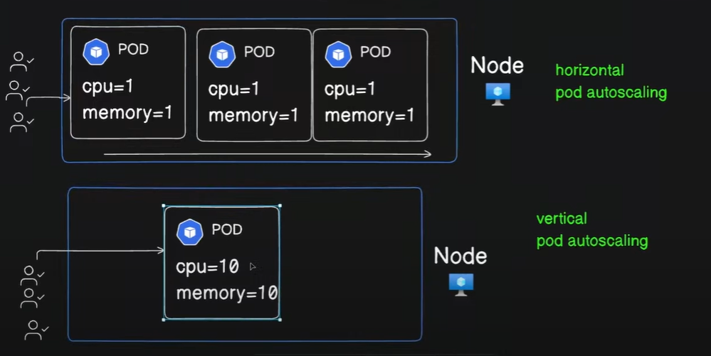 
  </div> <br>
    
  - Both Horizontal Autoscaling and Vertical Autoscaling can be either done either on workload(i.e. on pods) or on infra(i.e. on nodes).  

  - HPA - Horizontal Pod Autoscaling  
    1. The number of pods are increased as the load increases. This is also known as 'scale-out'/'scale-in'.
    2. Horizontal autoscaling when done on workload then it is known as HPA whereas when done on Infra it is known as 
        'Cluster Autoscaler'

  - VPA - Vertical Pod Autoscaling  
    1. The old pod is killed and the newer pod with increased resources is created. Application might face some   
        downtime during pod killing and creating newer one. 
    1. Vertical autoscaling is also known as 'scale-up'/'scale-down'. 
    2. Vertical scaling when done on workload is known as VPA whereas when done on infra nodes is known as Node     
        'AutoProvisioning'.

  - Only 'HPA' is provided in kubernetes by default. 'VPA' is a separate project on github which can be separately downloaded, installed and used. Whereas 'Cluster Autoscaler' and 'Node AutoProvisioning' are mostly provided by cloud providers such as AKS, EKS, GKE etc.

  <br> <div style="text-align: center;">
  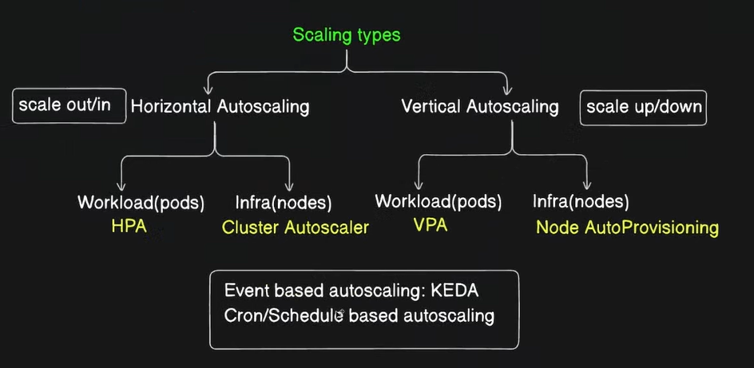 
  </div> <br>

  - Both HPA and VPA are based on some metrics whereas as there is yet another type of scaling based on events which is known as 'Event Based Autoscaling' 
  - Event based autoscaling is provided by third party tools such as KEDA which are provided by CNCF
  - Cron/Schedule based autoscaling is also used many times.
  
<br>
<!-----------------------------------------------------------------------  This is comment   --------------------------------------------------------------------->
<!---------------------------------------------------------------------------------------------------------------------------------------------------------------->

---
# <pre style="padding: 0; margin: 0 0"> <div style="padding: 0 40%; color: green; font-weight: bold;">   Day 18 </div>  </pre>
## <span style="color: #e1881c"> Kubernetes Health Probes </span>

- Probes are the processes that either monitor health of the system or grab stats of the system, or restore the system to its health.
- The purpose of health probes is to make sure that the application is healthy, self healing and the users are not impacted.
  
  <br> <div style="text-align: center;">
  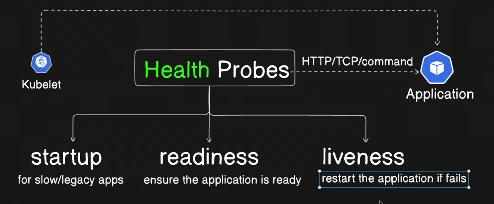 
  </div> <br>

- There are 3 types of Probes in kubernetes viz 

  <span style="font-weight: bold; color: #e1881c"> 1. Liveness Probes </span>
    - Liveness probes determine when to restart a container. 
      For example, liveness probes could catch a deadlock, when an application is running, but unable to make progress.
    - If a container fails its liveness probe repeatedly, the kubelet restarts the container.
    - Liveness probes do not wait for readiness probes to succeed. 
      If you want to wait before executing a liveness probe you can either define 'initialDelaySeconds', or use a startup probe.

      ```
        apiVersion: v1
        kind: Pod
        metadata:
          labels:
            test: liveness
          name: liveness-exec
        spec:
          containers:
          - name: liveness
            image: registry.k8s.io/busybox
            args:
            - /bin/sh
            - -c
            - touch /tmp/healthy; sleep 30; rm -f /tmp/healthy; sleep 600
            livenessProbe:
              exec:
                command:
                - cat
                - /tmp/healthy
              initialDelaySeconds: 5
              periodSeconds: 5
      ```

    - The 'initialDelaySeconds: 5' specifies that the liveness probes will wait for 5 seconds before it's first execution and after that
      liveness probe will be checked every '5' seconds as defined by 'periodSeconds' property.
  
  <span style="font-weight: bold; color: #e1881c"> 2. Readiness Probes </span>
    - Readiness probes determine when a container is ready to start accepting traffic. 
    - This is useful when waiting for an application to perform time-consuming initial tasks, 
      such as establishing network connections, loading files, and warming caches.
    - If the readiness probe returns a failed state, Kubernetes removes the pod from all matching service endpoints.
    - Readiness probes runs on the container during its whole lifecycle

    ```
      apiVersion: v1
      kind: Pod
      metadata:
        labels:
          test: liveness
        name: liveness-exec
      spec:
        containers:
        - name: liveness
        image: registry.k8s.io/e2e-test-images/agnhost:2.40                          
          args:
          - liveness
          livenessProbe:
            httpGet:
              path: /healthz
              port: 8080
            initialDelaySeconds: 3
            periodSeconds: 3
    ```
    - A http get request will be sent against the path '/healthz' and on port '8080' and if we do not get a response of successful HTTP status code 
      (like 200 OK) then the probe will fail.

  <span style="font-weight: bold; color: #e1881c"> 3. Startup Probes </span>
    - A startup probe verifies whether the application within a container is started. 
    - This can be used to adopt liveness checks on slow starting containers, avoiding them getting killed by the kubelet before they are up and running.
    - If such a probe is configured, it disables liveness and readiness checks until it succeeds.
    - This type of probe is only executed at startup, unlike liveness and readiness probes, which are run periodically.

- All these health probes can do 3 types of health checks 
  - <span style="font-weight: bold; color: #0098ff"> HTTP </span>  
    Will send a HTTP request to the endpoint after a specified time interval and based on the response it will pass/fail the health check.

    ```
      apiVersion: v1
      kind: Pod
      metadata:
        labels:
          test: liveness
        name: hello
      spec:
        containers:
        - name: liveness
          image: 'registry.k8s.io/e2e-test-images/agnhost:2.40'
          args:
          - liveness
          livenessProbe:
            httpGet:
              path: /healthz
              port: 8080
            initialDelaySeconds: 3
            periodSeconds: 3 
    ```

  - <span style="font-weight: bold; color: #0098ff"> TCP </span>  
    Will try to open a port at one of the endpoints and based on the response it will pass/fail the health check. 

    ```
      apiVersion: v1
      kind: Pod
      metadata:
        labels:
          app: tcp-pod
        name: tcp-pod
      spec:
        containers:
        - name: goproxy
          image: 'registry.k8s.io/goproxy:0.1'
          ports:
          - containerPort: 8080
          livenessProbe:
            tcpSocket:
              port: 8080
            initialDelaySeconds: 15
            periodSeconds: 10 
    ```

  - <span style="font-weight: bold; color: #0098ff"> Command </span>  
    It will issue a command against the endpoint and based on the command output it will pass/fail the health check. 

- <span style="font-weight: bold; color: #e1881c"> registry.k8s.io/busybox </span>

  - Image Size   
    The BusyBox image is lightweight, typically under 900KB, which helps in reducing upload and download times significantly compared to larger images like Alpine5.

  - Common Commands   
    BusyBox includes nearly 400 common UNIX commands, making it versatile for various scripting and operational tasks within containers5.

  - Usage in Kubernetes   
    To test connectivity and functionality with this image in a Kubernetes environment, users can run commands like:
    ```
    kubectl run hello-world -ti --rm --image=registry.k8s.io/busybox:latest --restart=Never -- date
    ```

  - This command will create a temporary pod that runs the date command using the BusyBox image2.
  - In summary, registry.k8s.io/busybox represents a significant resource for developers looking for a lightweight, efficient base image suitable for various 
    applications in Kubernetes environments.

- <span style="font-weight: bold; color: #e1881c"> registry.k8s.io/e2e-test-images/agnhost:2.40 </span>
  - The image <span style="color: #0098ff"> registry.k8s.io/e2e-test-images/agnhost:2.40 </span> is part of the Kubernetes end-to-end (E2E) testing framework 
    and is used to validate various Kubernetes functionalities. 
  - The agnhost image contains a binary that provides multiple subcommands, that can be executed within kubernetes pods, for testing different features within
    a Kubernetes cluster.

  - Following subcommands are available with 'agnhost' image 

    ```
      1. dns-server-list
         kubectl exec test-agnhost -- /agnhost dns-server-list                   # Outputs the host's configured DNS servers, separated by commas.

      2. dns-suffix
         kubectl exec test-agnhost -- /agnhost dns-suffix                        # Outputs the host's configured DNS suffix list, separated by commas.

      3. entrypoint-tester
         kubectl exec test-agnhost -- /agnhost entrypoint-tester foo lish args   # Prints the arguments it receives and exits.

      4. etc-hosts
         kubectl exec test-agnhost -- /agnhost etc-hosts                         # Outputs the contents of the host's /etc/hosts file.

      5. guestbook
         kubectl exec test-agnhost -- /agnhost guestbook             # Starts an HTTP server for a guestbook application with various endpoints for interaction.

      6. help
         kubectl exec test-agnhost -- /agnhost help                  # Prints the help menu for the agnhost binary or for a specific subcommand.

      7. inclusterclient
         kubectl exec test-agnhost -- /agnhost inclusterclient       # Periodically polls the Kubernetes /healthz endpoint to check health status.

      8. mounttest
         kubectl exec test-agnhost -- /agnhost mounttest [options]   # Creates files with various permissions and outputs file system details such as type, mode, owner, and permissions.

      9. netexec
         kubectl exec test-agnhost -- /agnhost netexec [options]     # Creates HTTP(S), UDP, and optionally SCTP servers with various endpoints for testing network functionality.

      10. podinfo
         kubectl exec test-agnhost -- /agnhost podinfo               # Provides information about the pod it is running in.

      11. liveness
          kubectl exec test-agnhost -- /agnhost liveness             # Starts a simple server that remains healthy for 10 seconds and then reports itself as unhealthy.

    ```
    <span style="color: #e1881c"> exec </span>  
      This subcommand is used to execute commands within a running container in a specified pod. 
      It allows you to interact with the container's environment, similar to SSH access on a virtual machine.

    <span style="color: #e1881c"> test-agnhost </span>  
      This is the name of the pod where the command will be executed. The pod must be running for the command to work.

    <span style="color: #e1881c"> --  </span>  
      The double dash (--) is used to separate the kubectl exec options from the command that will be executed inside the container. Everything following this separator is treated as part of the command to run within the container.

    <span style="color: #e1881c"> /agnhost liveness  </span>  
      This specifies the command and its arguments that you want to execute inside the container.
      /agnhost refers to an executable located within the container, which is part of the agnhost image, commonly used in Kubernetes for testing and debugging.
      liveness is an argument passed to the /agnhost executable, which typically indicates that you want to perform a liveness check.

<br>
<!-----------------------------------------------------------------------  This is comment   --------------------------------------------------------------------->
<!---------------------------------------------------------------------------------------------------------------------------------------------------------------->

---
# <pre style="padding: 0; margin: 0 0"> <div style="padding: 0 40%">   Day 19 </div>  </pre>
## <span style="color: #e1881c"> Kubernetes ConfigMap and Secrets </span>

- All the environment variables that we want to share across the containers, are stored inside the configmap file.
  
- Config maps can be created in two ways  
  
  <span style="color: #e1881c"> 1. Imperative way </span>  
    ```
      kubectl create cm app-cm --from-literal=firstname=Ram --from-literal=lastname=patil  
      kubectl create cm app-cm --from-file=app.config                                       # If you want to specify the entire config file 
    ```

  <span style="color: #e1881c"> 2. Declarative way </span>  
    ```
      apiVersion: v1 
      kind: Pod
      metadata:
        name: env-configmap
      spec:
        containers:
        - name: env-vars-test-container
          image: nginx
          env:
            name: CONFIGMAP_USERNAME
            valueFrom:
              configMapKeyRef:
                name: app-cm      
                key: firstname
    ```

- It is a best practice to map configmaps and secrets as volume. Volume that is storage space is created that is associated with a container on a particular path 
  and the environment variables can be consumed from this path.
  ```
    apiVersion: v1
    kind: Pod
    metadata:
      name: dapi-test-pod
    spec:
      containers:
        - name: test-container
          image: registry.k8s.io/busybox 
          command: ["/bin/sh", "-c", "ls /etc/config/"]
          volumeMounts:
          - name: config-volume
            configMap:
              name: special-config 
      volumes:
      - name: config-volume
        configMap:
          name: special-config
      restartPolicy: Never
  ```

- ConfigMap yaml file 
  ```
    apiVersion: v1 
    kind: ConfigMap
    metadata: 
      creationTimestamp: null
      name: app-cm
    data:
      firstname: Jeff
      lastname: Bezose
  ```

- Use following command to create a configMap  
    <span style="color: #e1881c"> kubectl create --save-config -f app.config </span>

- Loading all the environment variables from a configMap file 
  ```
    apiVersion: v1 
    kind: Pod
    metadata: 
      name: configmap-pod
    spec:
      containers:
      - name: test-container
        image: busybox
        command: ["/bin/sh", "-c", "env"]
        envFrom:
        - configMapRef: 
          name: app-cm 
      restartPolicy: Never
  ```

<br>
<!-----------------------------------------------------------------------  This is comment   --------------------------------------------------------------------->
<!---------------------------------------------------------------------------------------------------------------------------------------------------------------->

---
# <pre style="padding: 0; margin: 0 0"> <div style="padding: 0 40%">   Day 20 </div>  </pre>
## <span style="color: #e1881c"> SSL/TLS Explained </span>

  1. <span style="color: #e1881c"> Symmetric Encryption </span>   
      Same key is used for encryption and decryption

  2. <span style="color: #e1881c"> Asymmetric Encryption  </span>  
      Different keys are used for encryption and decryption

  3. <span style="color: #e1881c"> ssh-keygen / OpenSSL  </span>  
      It is the utility that creates public and private key pairs. Public key is accessible publicly and private key is accessible only to the owner.


  - To validate the public key of the server, certificates are used. 
  - Certificates are validated by the browser which check whether that certificate was issued to that server, domain name and the 
    associated public key with that certificate. 
  - The connection established using the certificate is known as HTTPS connection.
  - Server creates a Certificate Signing Request (CSR), which is then issued and signed by the Certificate Authority(CA). 
  - CA validates the CSR by checking whether the server owns the domain or not, then signs the request and sends the certificate to the server. 
  - This certificate acts as an public key. 
  - Symentac and Digicert are an examples of public Certificate Signing Authorities (CAs).
  - In case of private networks which are used only within an organization, custom CAs are hosted which sign and issue the certificates.

<br>
<!-----------------------------------------------------------------------  This is comment   --------------------------------------------------------------------->
<!---------------------------------------------------------------------------------------------------------------------------------------------------------------->

---
# <pre style="padding: 0; margin: 0 0"> <div style="padding: 0 40%">   Day 21 </div>  </pre>
## <span style="color: #e1881c"> Manage TLS Certificates </span>

<span style="font-weight: bold; color: #e1881c"> Digital Certificate </span>  

1. **Definition**  
    A digital certificate is an electronic document issued by a trusted third party known as a Certificate Authority (CA). It binds a public key to an entity (such as an individual or organization) and verifies their identity.

2. **Contents**    
    A digital certificate typically includes:  
      - The public key of the entity.  
      - Information about the entity (e.g., name and organization).  
      - The CA's information and digital signature, which validates the authenticity of the certificate.  

3. **Purpose**  
    Digital certificates facilitate secure communications by enabling users to authenticate each other’s identities. They help prevent man-in-the-middle attacks by ensuring that users are communicating with legitimate entities

<span style="font-weight: bold; color: #e1881c"> Main Components of a Digital Certificate </span>

- Digital certificates contain following information 

  1. **Version Number**  
    This indicates which version of the X.509 standard is being used, typically version 3 for most modern certificates.
  
  2. **Serial Number**  
    Each certificate issued by a CA has a unique serial number, which helps in tracking and managing certificates.
  
  3. **Signature Algorithm Identifier**  
    This specifies how the digital signature is generated, using algorithms like SHA-256 with RSA encryption.
  
  4. **Issuer Name**  
    This identifies the CA that has issued and signed the certificate, creating a chain of trust.
  
  5. **Validity Period** 
    Certificates are not valid indefinitely; this component specifies when a certificate becomes valid and when it expires.
  
  6. **Subject Name**  
    This includes identifying information about the entity that owns the certificate, such as their name or organization.
  
  7. **Subject Public Key Information**  
    This contains not only the public key but also details about its algorithm and intended usage.
  
  8. **Digital Signature**  
    The CA signs the entire certificate with its private key to ensure that it cannot be altered without detection.
  
  9. **Extensions**  
    These provide additional capabilities or restrictions for how the certificate can be used, such as whether it can be used for email encryption or code signing.
  
- Digital certificates play a crucial role in establishing secure communications by verifying identities and enabling encrypted data exchange over networks, such as in SSL/TLS protocols for secure web browsing

<span style="font-weight: bold; color: #e1881c"> How a secure communication is established between client and server with the help of Digital certificates </span>

- Digital certificates play a crucial role in establishing secure communication between clients and servers, particularly in the context of internet protocols like SSL/TLS. 

- Here’s how the process works:  Steps to Establish Secure Communication Using Digital Certificates

  1. **Certificate Request**  
    The server generates a public-private key pair and creates a Certificate Signing Request (CSR) that includes its public key and identifying information.
    The server sends this CSR to a trusted Certificate Authority (CA) for validation.

  2. **Identity Verification by CA**  
    The CA verifies the identity of the server through various methods, which may include checking domain ownership or organizational details.
    Once verified, the CA issues a digital certificate that binds the server's identity to its public key.

  3. **Certificate Installation**  
    The server installs the digital certificate, which contains its public key, identity information, and the CA's digital signature.

  4. **Client Connection Initiation**  
    When a client (e.g., a web browser) attempts to connect to the server, it requests the server's digital certificate to verify its identity.

  5. **Certificate Validation**  
    The client checks the digital certificate against a list of trusted CAs stored in its system. It verifies:
      - That the certificate is signed by a trusted CA.
      - That it is within its validity period.
      - That it has not been revoked.
    
  6. **Establishing a Secure Session**  
    If the certificate is valid, the client uses the public key from the certificate to encrypt a session key (a symmetric key used for encrypting data during the session).
    This encrypted session key is sent to the server.

  7. **Session Key Decryption**  
    The server uses its private key to decrypt the session key sent by the client.
    Both parties now share a symmetric session key that will be used for encrypting subsequent communications.

  8. **Secure Data Transmission**  
    All data exchanged between the client and server is encrypted using the session key, ensuring confidentiality and integrity.
    This prevents eavesdropping and tampering by malicious actors.
    Benefits of Using Digital Certificates

  9. **Authentication**  
    Digital certificates confirm that clients are communicating with legitimate servers, preventing impersonation or phishing attacks.

  10. **Encryption**  
    They enable secure encryption of data transmitted over networks, protecting sensitive information from interception.

  11. **Data Integrity**  
    Digital certificates help ensure that data has not been altered during transmission.

  12. **Trust**  
    Certificates issued by trusted CAs establish a chain of trust, assuring users that they are interacting with verified entities.

  In summary, digital certificates are essential for establishing secure communication between clients and servers.   
  They authenticate identities, facilitate encrypted connections, and ensure data integrity throughout online interactions.

<span style="font-weight: bold; color: #e1881c"> Do https connections use session keys for communication after establishing the initial communication using public and private keys ? </span>

- Yes, HTTPS connections do use session keys for communication after establishing the initial connection using public and private keys. 

- Here’s how this process works:

  Overview of HTTPS and Session Keys
  1. **TLS Handshake**  
    When a client (like a web browser) initiates a connection to a server over HTTPS, it begins with a TLS handshake.  
    This handshake involves several steps, during which asymmetric encryption is used to establish a secure connection.

  2. **Asymmetric Encryption for Initial Setup**  
    The server sends its digital certificate to the client, which contains the server's public key.
    The client verifies the certificate and uses the server's public key to encrypt a random number (often referred to as a "pre-master secret") and sends it to the server.
    The server decrypts this message using its private key, allowing both parties to derive the same master secret.

  3. **Generation of Session Keys**  
    From the master secret, both the client and server generate session keys. These session keys are symmetric keys that will be used for encrypting and decrypting data during the session.
    Session keys are temporary and unique to each session, enhancing security by limiting the amount of data encrypted with a single key.

  4. **Symmetric Encryption for Data Transmission**  
    Once the session keys are established, all subsequent data exchanged between the client and server is encrypted using these symmetric session keys.
    This transition from asymmetric to symmetric encryption is crucial because symmetric encryption is generally faster and more efficient for handling larger volumes of data.

  5. **Session Key Lifecycle**  
    Each session key is used only for one communication session. After the session ends (when the connection is closed), the session key is discarded. A new handshake will be required for subsequent connections, generating new session keys.

    **Summary**  
    In summary, HTTPS connections utilize both asymmetric and symmetric encryption techniques.  
    Initially, asymmetric encryption establishes a secure channel through public-private key pairs during the TLS handshake.  
    After this setup, symmetric session keys are generated and used for efficient data transmission throughout the session, ensuring secure communication between the client and server.

  <br> <div style="text-align: center;">
  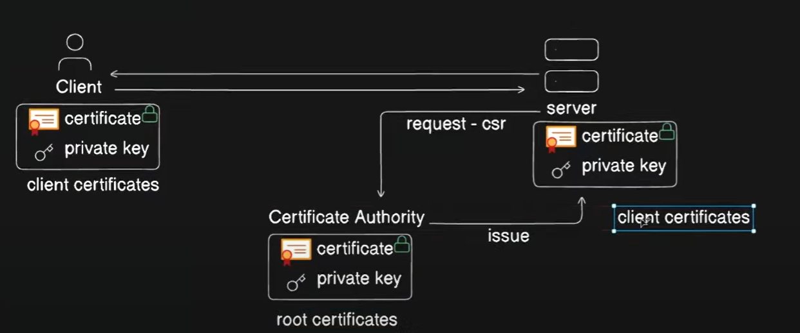 
  </div> <br>

<span style="font-weight: bold; color: #e1881c"> Kubernetes Certificates </span>  
  - In kubernetes, there are 3 kinds of certificates  
    1. Root Certificates (Generated by CAs)
    2. Client Certificates (Generated by client) and 
    3. Server Certificates (Generated by server).

  <br> <div style="text-align: center;">
  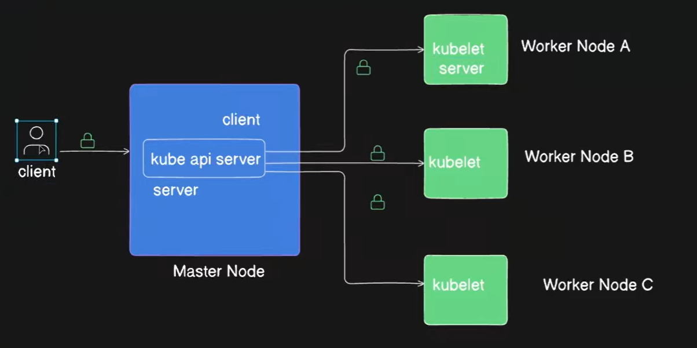 
  </div> <br>

  - All the communications between master and worker nodes is encrypted in kubernetes.
  - Therefore, all the components in the kubernetes need to have private key and associated certificate with that key.

  <br> <div style="text-align: center;">
  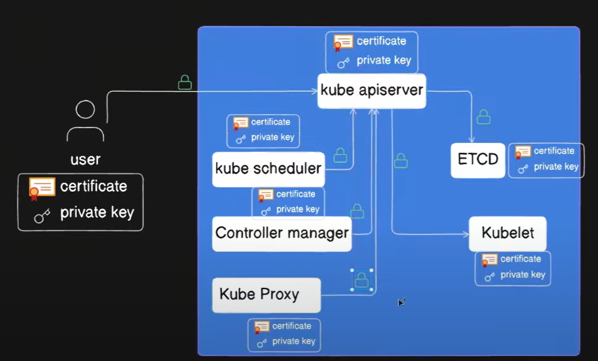 
  </div> <br>

  - Certificate files either end with '.crt' extention or do not contain the word 'key' in their filename.
    ```
    server.crt
    server.pem
    client.crt
    client.pem
    ```

  - Whereas, private keys has one of the following extensions. By convention, the private keys have work 'key' in their file name.
    ```
    server.key
    server-key.pem
    client.key
    client-key.pem
    ```

  - Following command will create private key named 'adam.key' using openssl utility 
    ```
    openssl genrsa -out adam.key 2048
    ```

  - Using the private key generated above create a Certificate Signing Request (CSR) as below. Following command worked properly in powershell but was giving errors in git bash. 
    ```
    openssl req -new -key adam.key -out adam.csr -subj "/CN=adam"
    ```

  - create a CSR.yaml file as follow by replacing the name to 'adam' or as per the keys created in above steps. 
    Also, replace the 'request' string by the base64 format of 'adam.csr' string. 
    For that purpose, use following command -
    ```
    cat adam.csr | base64 | tr -d "\n" 
    ``` 

  - CSR.yaml file 
    ```
    apiVersion: certificates.k8s.io/v1
    kind: CertificateSigningRequest
    metadata:
      name: adam
    spec:
      request: LS0tLS1CRUdJTiBDRVJUSUZJQ0FURSBSRVFVRVNULS0tLS0KTUlJQ1ZqQ0NBVDRDQVFBd0VURVBNQTBHQTFVRUF3d0dZVzVuWld4aE1JSUJJakFOQmdrcWhraUc5dzBCQVFFRgpBQU9DQVE4QU1JSUJDZ0tDQVFFQTByczhJTHRHdTYxakx2dHhWTTJSVlRWMDNHWlJTWWw0dWluVWo4RElaWjBOCnR2MUZtRVFSd3VoaUZsOFEzcWl0Qm0wMUFSMkNJVXBGd2ZzSjZ4MXF3ckJzVkhZbGlBNVhwRVpZM3ExcGswSDQKM3Z3aGJlK1o2MVNrVHF5SVBYUUwrTWM5T1Nsbm0xb0R2N0NtSkZNMUlMRVI3QTVGZnZKOEdFRjJ6dHBoaUlFMwpub1dtdHNZb3JuT2wzc2lHQ2ZGZzR4Zmd4eW8ybmlneFNVekl1bXNnVm9PM2ttT0x1RVF6cXpkakJ3TFJXbWlECklmMXBMWnoyalVnald4UkhCM1gyWnVVV1d1T09PZnpXM01LaE8ybHEvZi9DdS8wYk83c0x0MCt3U2ZMSU91TFcKcW90blZtRmxMMytqTy82WDNDKzBERHk5aUtwbXJjVDBnWGZLemE1dHJRSURBUUFCb0FBd0RRWUpLb1pJaHZjTgpBUUVMQlFBRGdnRUJBR05WdmVIOGR4ZzNvK21VeVRkbmFjVmQ1N24zSkExdnZEU1JWREkyQTZ1eXN3ZFp1L1BVCkkwZXpZWFV0RVNnSk1IRmQycVVNMjNuNVJsSXJ3R0xuUXFISUh5VStWWHhsdnZsRnpNOVpEWllSTmU3QlJvYXgKQVlEdUI5STZXT3FYbkFvczFqRmxNUG5NbFpqdU5kSGxpT1BjTU1oNndLaTZzZFhpVStHYTJ2RUVLY01jSVUyRgpvU2djUWdMYTk0aEpacGk3ZnNMdm1OQUxoT045UHdNMGM1dVJVejV4T0dGMUtCbWRSeEgvbUNOS2JKYjFRQm1HCkkwYitEUEdaTktXTU0xMzhIQXdoV0tkNjVoVHdYOWl4V3ZHMkh4TG1WQzg0L1BHT0tWQW9FNkpsYWFHdTlQVmkKdjlOSjVaZlZrcXdCd0hKbzZXdk9xVlA3SVFjZmg3d0drWm89Ci0tLS0tRU5EIENFUlRJRklDQVRFIFJFUVVFU1QtLS0tLQo=
      signerName: kubernetes.io/kube-apiserver-client
      expirationSeconds: 86400  # one day
      usages:
      - client auth
    ```
  
  - Now, apply the .yaml file created above to create Certificate Signing Request
    ```
    kubectl apply -f csr.yaml                                 # create the certificate signing request using yaml config  
    kubectl get csr                                           # List out all the certificate signing requests
    kubectl describe csr adam                                 # Describe the certificate signing request 'adam' 
    kubectl certificate approve adam                          # Approve the certificate signing request of 'adam'
    
    kubectl get csr/adam -o yaml
    (OR) kubectl get csr adam -o yaml > issueCert.yaml        # To get the Certificate named 'adam' and share with the User. Retrieve the certificate from the CSR.
    
    # The certificate value is in Base64-encoded format under status.certificate.
    # Export the issued certificate from the CertificateSigningRequest.

    kubectl get csr adam -o jsonpath='{.status.certificate}'| base64 -d > adam.crt
    ```

  - The certificate in issueCert.yaml file generated in above steps contain the certificate in base64 encoded format. 
    To decode it and give it to the user, use following command. The following certificate aan be used in kubeConfig and can be used to assign different roles and permissions to the user. 
    ```
    echo <certificate from issueCert.yaml file> | base64 -d 
    ```

<br>
<!-----------------------------------------------------------------------  This is comment   --------------------------------------------------------------------->
<!---------------------------------------------------------------------------------------------------------------------------------------------------------------->

---
# <pre style="padding: 0; margin: 0 0"> <div style="padding: 0 40%">   Day 22 </div>  </pre>
## <span style="color: #e1881c"> Kubernetes Authentication and Authorization </span>

- Kubeconfig files contain the configurations that are used while issuing commands to the kubectl utility.
- If we do not specify the kubectl config files along with kubectl commands then the default config file is used.
- The default kubeconfig file is present in the following directory 
  ```
  /user/adam/.kube/         # On Linux
  /c/Users/rakes/.kube      # On windows
  ```
- Contexts are nothing but the combination of the users and the clusters that they can access.
- Sample kubeconfig file looks like 
  ```
  apiVersion: v1 
  kind: Config
  clusters:             # Multiple clusters can be specified in kubeconfig file
  - cluster:
    name: development
  - cluster:
    name: test

  users:                # List of the users that have certain permissions to perform the tasks.
  - name: developer
  - name: experimenter

  contexts:
  - context:
    name: dev-frontend
  - context:
    name: dev-storage
  - context:            # In context you can specify the name of the user and the cluster that he/she can work.
      cluster: test 
      user: developer
    name: exp-test
  ```

  <br> <div style="text-align: center;">
  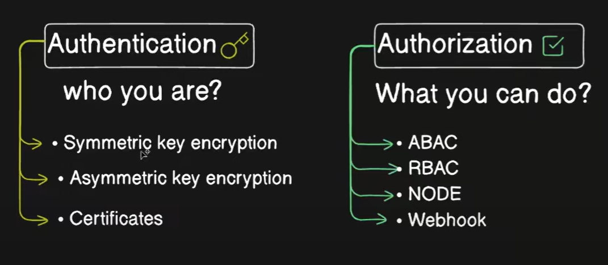 
  </div> <br>

  - Authentication is the process of identifying the user whereas authorization is the process to check whether user has the required permissions to perform a 
    certain task.
  - Kubernetes has following types of authorization modes 
    1. <span style="color: #e1881c"> ABAC - Attribute based authorization </span>    
       In ABAC, we attribute a set of permissions to a user, add those permissions to a file also known as 'policy' file, add that file to apiServer config and 
       restart the apiServer. These tasks are difficult to maintain and restart the apiServer each time we make updates. 

    2. <span style="color: #e1881c"> RBAC - Role Based authorization </span>    
      In RBAC, we create roles, assign certain permissions to it and assign that role to a user or group of users. Every time there is change of the role, we 
      just change the role of the user and other users are not impacted. Here, we do not need to restart the apiServer.

    3. <span style="color: #e1881c"> NODE Based authorization</span>    
      Node based authorization is generally used by nodes to interact with each other such as apiServer interacting with the kubelet. 

    4. <span style="color: #e1881c"> Webhook Based authorization</span>    
      Webhook based authorization used thrid party agents such as Open Policy Agents(OPA) which will do the access management for you. Whenever, a request is sent 
      to the user, it goes to the OPA agent running on the server which either grants of denies that request after processing it.

  - Issue following commands to login to the control plane containers
  
    ```
    docker ps | grep control                         #  List out all the containers running on the machine, and filter out 'control' 
                                                        plane related containers.

    docker exec -it cka-cluster-control-plane bash   #  Running a bash terminal in interactive mode on that control plane container.

    cd etc/kubernetes/manifests/ 

    cat kube-apiserver.yaml
    ```

  - Inside the above .yaml file, all the subcommands mentioned under '- command:' are different configurations that are passed as an argument 
    to the kubectl commands.

  - '--authrization-mode' :- In the same configurations, '--authorization-mode' specifies the authorization policy to be used for communicating 
    using that command. If no policy is specified then it will default out to the 'AlwaysAllow' which will grant access to all without any restriction. 'AlwaysDeny' policy will deny everything. 

  - '--authorization-policy-file' :- The authorization can also be specified using a file.

  - For kubernetes components such as 'apiServer', all the details regarding the policy etc are specified inside their .yaml file.

  - The directory where all the certificate files and keys are stored by default.
    ```
      "/etc/kubernetes/pki" 
    ```

  - 
<br>
<!-----------------------------------------------------------------------  This is comment   --------------------------------------------------------------------->
<!---------------------------------------------------------------------------------------------------------------------------------------------------------------->

---
# <pre style="padding: 0; margin: 0 0"> <div style="padding: 0 40%">   Day 23 </div>  </pre>
## <span style="color: #e1881c"> Kubernetes Role Based Access Control RBAC  1 </span>

  - To check whether a user has an access for a particular operation or not 
  ```
    kubectl auth can-i get pod              # Do I have access to Get the pods ?
    kubectl auth can-i get pod --as Adam    # Does 'Adam' has access to Get the pods ?
    kubectl auth whoami                     # which user am I ?
  ```

  - <span style="color: #e1881c"> Core Group Vs Named Group </span>  
    If 'apiVersion' just contins 'v1' then it is core group whereas if it contains 'app/v1' or 'rbac.authorization.k8s.io/v1' then it is named group.

  - Imperative Way of Creating Role
    ```
    kubectl create role developer --verb=create --verb=get --verb=list --verb=update --verb=delete --resource=pods
    (OR) kubectl create role developer --verb=create,get,list,update,delete --resource=pods
    ```

  - Declarative Way : Sample Role.yaml file 
    ```
    apiVersion: rbac.authorization.k8s.io/v1
    kind: Role
    metadata:
      namespace: default
      name: pod-reader
    rules:
    - apiGroups: [""] # "" indicates the core API group
      resources: ["pods"]
      verbs: ["get", "watch", "list"]
    ```

  - Resources can be Pods, Deployment, state-full state, Cronjob etc
  - Verb is a type of access.
  - Following will create a 'pod-reader' role
    ```
      kubectl apply -f Role.yaml
    ```
    
  - Imperative Command for Creating Role-Binding
    ```
    kubectl create rolebinding developer-binding-myuser --role=developer --user=myuser
    ```

  - Declarative Way : Sample Role-Binding yaml file 
    ```
    apiVersion: rbac.authorization.k8s.io/v1   # This role binding allows adam to read pods in the default namespace
                                               # You need to have a Role named 'Pod-reader' in that namespace
    kind: RoleBinding
    metadata:
      name: read-pods
      namespace: default
    subjects:
    # You can specify more than one subject
    - kind: User
      name: adam        # "name" is case sensitive
      apiGroup: rbac.authorization.k8s.io
    roleRef:
      # 'roleRef' specifies the binding to a Role / ClusterRole
      kind: Role        # This must be Role or ClusterRole
      name: pod-reader  # This must match with the name of the Role or Cluster Role you wish to bind to.
      apiGroup: rbac.authorization.k8s.io
    ```

  - Some commands regarding Role-Binding
    ```
    kubectl apply -f role-binding.yaml            # Apply Role Binding
    kubectl get rolebinding                       # Get Role Bindings
    kubectl describe rolebinding read-pods        # Get details about the rolebinding 'read-pods'
    kubectl get roles                             # Get the roles created in this namespace
    kubectl get roles -A                          # Get the roles created in all the namespaces
    kubectl get roles -A --no-headers | wc -l     # Count the number of roles created in all the namespaces

    # The following command is used to set or update the credentials for a user named "krishna". 
    # It specifies the client key and certificate for authentication but does not associate this user with any context. 

    kubectl config set-credentials adam --client-key=../day21_tlskubernetes/adam.key --client-certificate=../day21_tlskubernetes/adam.crt

    # The following command sets or updates the context named "krishna" to use a specific cluster, 
    # but it does not associate any user with that context.

    kubectl config set-context krishna --cluster=kind-cka-cluster

    # To properly associate the user "krishna" with the existing context named 'krishna', you need to set the context to use that user. 
    # Therefore, you should run:
    
    kubectl config set-context krishna --user=krishna

    # The following command sets or updates the context named "krishna" to use a cluster named 'kind-cka-cluster' and 
    # also associate the user 'krishna' with the context 'krishna'. It is combination of above two commands. 
    
    kubectl config set-context krishna --user=krishna --cluster=kind-cka-cluster

    kubectl config get-contexts                                      # List all the contexts 
    kubectl config use-context adam                                  # Switch to context 'adam' 
    kubectl config view                                              # To get details of the current context. 
    ```
  - Calling the kubernetes API using curl command  
    (The certificate "ca.crt" you can find inside directory "/etc/kubernetes/pki" of API-server/control plane node. ))
    ```

    curl -k https://localhost:64418/api/v1/namespaces/default/pods  --key krishna.key --cacert ca.crt  --cert krishna.crt
    # The control plane is accessible on http://localhost:64418
    # As we are not passing the context in above command, we need to pass the certificates in the command.
    ```

### <span style="color: #e1881c"> Kubernetes API Calls </span>
- All the commands that are issued using kubectl utility interact with the API-Server. 
- The following curl command can be issued to get the version of the kubertetes
  ```
  $ curl -k https://127.0.0.1:52139/version
  {
    "major": "1",
    "minor": "31",
    "gitVersion": "v1.31.0",
    "gitCommit": "9edcffcde5595e8a5b1a35f88c421764e575afce",
    "gitTreeState": "clean",
    "buildDate": "2024-08-13T22:44:37Z",
    "goVersion": "go1.22.5",
    "compiler": "gc",
    "platform": "linux/amd64"
  }
  ```
- Whereas, the following command returns the list of the pods
  ```
  curl https://localhost:52139/api/v1/pods 
  ```

- Kubernetes APIs are grouped into multiple groups based on their purpose such as - 
  ```
  1. /metrics   - Used to monitor health of the cluster
  2. /healthz   - Used to monitor health of the cluster
  3. /version   - Get details about API version
  4. /api       - responsible for cluster functionality (core group)
  5. /apis      - responsible for cluster functionality (named group)
  6. /logs      - Used for integrating with 3rd party logging applications   
  ```

- APIs responsible for the cluster functionality are classified into two groups 
  1. Core group APIs
    - Core group APIs provide core functionality of kubernetes cluster as shown in following diagram -  
    
      <br> <div style="text-align: center;">
      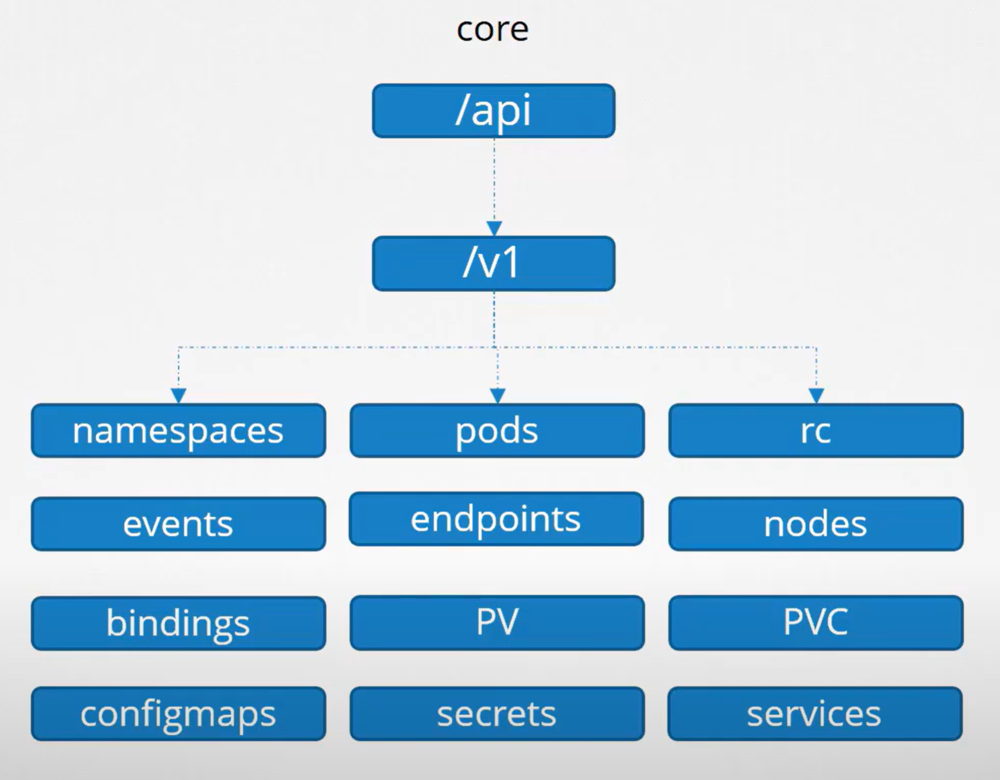 
      </div> <br>
  
  2. Named group APIs 
    - Named Group APIs are more organized and all the upcoming features will be made available under these APIs.
    - It has groups under it for apps, extensions, networking, storage, authentication, authorization etc
    - Each API group has certain resources associated with it and there are certain actions, known as 'Verbs', that are associated with these resources.
    - '6443' is a default port for the KubeAPI server.

      <br> <div style="text-align: center;">
      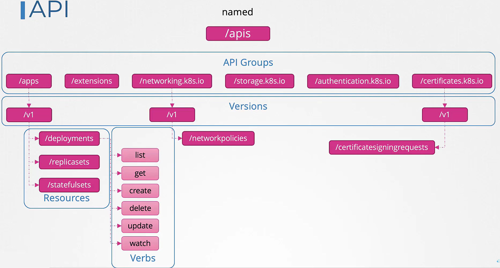 
      </div> <br>
  
- If you call the API without any name then it will return all the API groups where as if you call the API on API group 
  then it will return resources under that API group.
  ```
  curl -k http://localhost:52139                            # Returns API groups 
  curl -k http://localhost:52139/apis -k | grep "name"      # Returns resources under API group 'apis' 
  ```

- Direct access to the APIs is not allowed except for the version API. All other APIs need to authenticated using 
  certificate file like below -
  ```
  curl -k http://localhost:6443 -k --key admin.key --cert admin.crt --cacert ca.crt
  ```

- Alternatively, you can issue curl commands without passing the certificates by issuing these commands in the 'kubectl proxy client'. 
  Kubectl proxy client launches a server locally on port 127.0.0.1:8001 and uses certificates from the kubeconfig file to access the cluster. 

- Please note that "kube proxy" and "kubectl proxy" are not the same.
- APIs have alpha, beta and stable versions. Their significance is shown below. Alpha is then version when the API is first developed and merged to the Kubernetes codebase and becomes the part of the kubernetes release for the first time. These API groups are not enabled by default. You need to explicitly enable them.
- Beta versions are enabled by default, are already tested whereas GA(General availability) or Stable versions are enabled by default, stable and highly reliable.
- An API group can support multiple versions at the same time. Even though multiple versions supported at the same time, there can be the preferred/storage version. Kubectl commands will return the preferred versions.

1. **Preferred Version**  
  - Preferred Version is the default version used when we retrieve the information.
  - Setting up preferred version in .yaml file
    ```
    {
      "kind": "APIGroup",
      "apiVersion": "v1", 
      "name": "batch",  
      "versions": [
        {
          "groupVersion": "batch/v1", 
          "version": "v1"
        },
        {
          "groupVersion": "batch/v1beta1", 
          "version": "v1beta1"
        }
      ],
      "preferredVersion":{
        "groupVersion": "batch/v1",
        "version": v1
      }
    }
    ```

2. **Storage Version**  
  - It is the version in which the kubernetes objects are stored in etcd database irrespective of the version you have used in .yaml file while creating the object.
  - It is not possible to check the storage version of particular API through an API or Command.
  - We can get the storage version by querying the etcd database directly.

  <br> <div style="text-align: center;">
  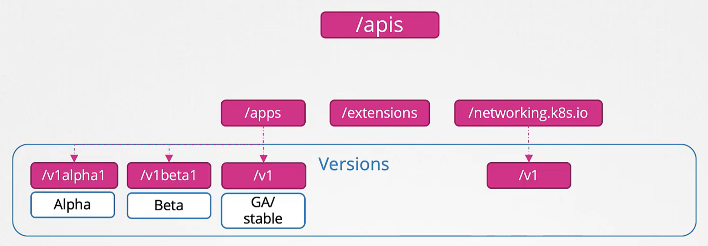 
  </div> <br>

  <br> <div style="text-align: center;">
  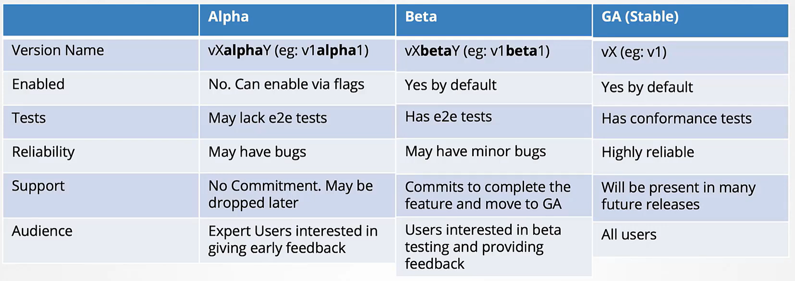 
  </div> <br>

    
- Usually, preferred and storage versions are different but they can also be same.
- Enabling/Disabling of the API versions is done through the runtime config parameters of the kube-API servers. 

### <span style="color: #e1881c"> API Deprecation </span>
  1. **Rule 1**  
    API elements may only be removed by incrementing the version of the API group.

  <br> <div style="text-align: center;">
   
  </div> <br>

  2. **Rule 2**  
    API objects must be able to round trip between API versions in a given release without information loss, with the exception of whole REST resources that do not exist in some versions.

  <br> <div style="text-align: center;">
  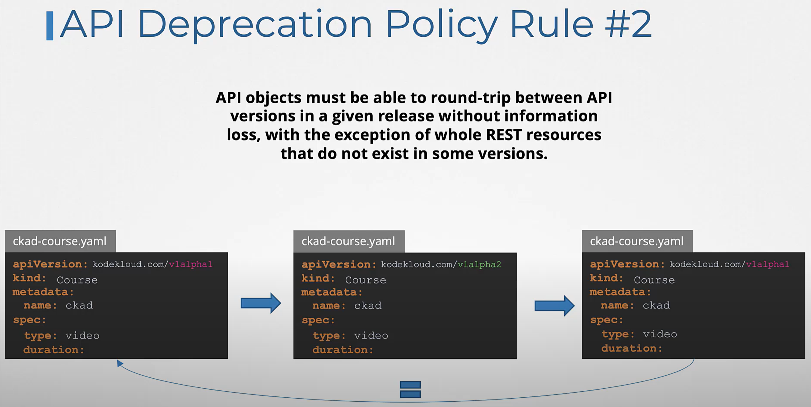 
  </div> <br>
  
  3. **Rule 3**  [Click Here For Resource 👆](https://youtu.be/_65Md2qar14?t=1590)  
    An API version in a given track may not be deprecated until a new API version at least as stable is released.  
    
  4. **Rule 4a**  [Click Here For Resource 👆](https://youtu.be/_65Md2qar14?t=1263)  
    Other than the most recent API versions in each track, older API versions must be supported after their announced deprecation for a duration of no less than:  
      - **GA** : 12 months or 3 releases (whichever is longer)  
      - **Beta**  : 9 months or 3 releases (whichever is longer)  
      - **Alpha** : 0 releases 

  5. **Rule 4b** [Click Here For Resource 👆](https://youtu.be/_65Md2qar14?t=1424)  
    The "preferred" API version and the "storage version" for a given group may not advance until after a release has been made that supports both the new version and the previous version.

### <span style="color: #e1881c"> Kubectl Convert Command </span> [Click Here For Resource 👆](https://youtu.be/_65Md2qar14?t=1652)
- When Kubernetes clusters are upgraded, we have new APIs being added and the old one being deprecated and removed.
- When older APIs are deprecated it is important to update the existing manifest files to newer versions.
  ```
  kubectl convert -f <old-file> --output-version <new-api>
  e.g. -
    kubectl convert -f nginx.yaml --output-version apps/v1
  ```
- Install kubectl convert utility - https://youtu.be/_65Md2qar14?t=1715

<br>
<!-----------------------------------------------------------------------  This is comment   --------------------------------------------------------------------->
<!---------------------------------------------------------------------------------------------------------------------------------------------------------------->

--- 
# <pre style="padding: 0; margin: 0 0"> <div style="padding: 0 40%">   Day 24 </div>  </pre>
## <span style="color: #e1881c"> Kubernetes RBAC 2 - ClusterRole </span>

- Roles are namespace scoped i.e. all the resources that are within namespace only those will be applicable for the role and role-binding.
- Following are the namespace scoped resources -
  1. pods
  2. deployments
  3. rs, services etc
  
- Following are cluster scoped resources -
  1. namespaces
  2. nodes etc
  
- To access the resources at cluster level we create cluster-roles.

- Role Binding  
  <br> <div style="text-align: center;">
  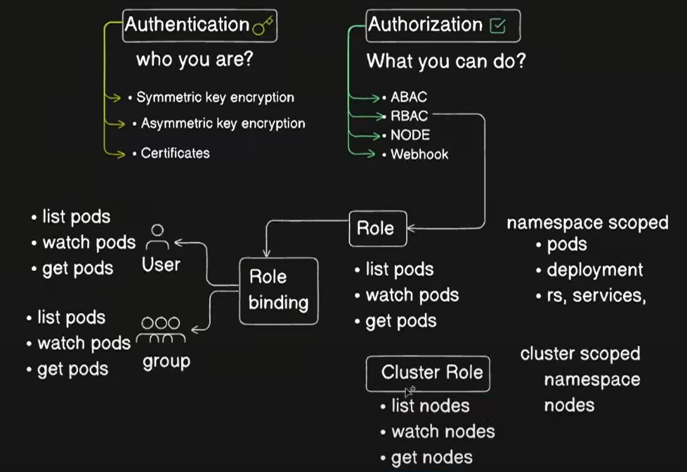 
  </div> <br>

- Cluster Role Binding  
  <br> <div style="text-align: center;">
  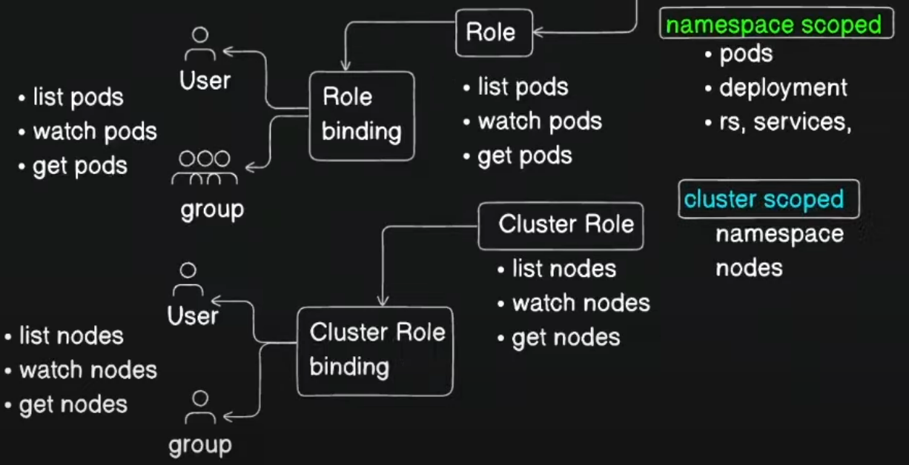 
  </div> <br>

  ```
  kubectl api-resources --namespaced=true                   :-  Lists out all the apiVersion values for all the resources in kubernetes at Namespaced Level.
  kubectl api-resources --namespaced=false                  :-  Lists out all the apiVersion values for all the resources in kubernetes at Cluster Level.

  kubectl create clusterrole node-reader --verb=get,list,watch --resource=node 
                                                            :-  Create a clusterrole named 'node-reader' with permissions for get, list and 
                                                                watch operations for 'node' resource.

  kubectl get clusterrole | grep node-reader                :-  Get the cluster roles.
  kubectl get clusterrolebinding | grep node-reader         :-  Get the cluster role bindings.

  kubectl create clusterrolebinding reader-binding --clusterrole=node-reader --user=krishna     :- Bind the clusterrole "node-reader" to user "krishna" 
  ```
<br>
<!-----------------------------------------------------------------------  This is comment   --------------------------------------------------------------------->
<!---------------------------------------------------------------------------------------------------------------------------------------------------------------->

---
# <pre style="padding: 0; margin: 0 0"> <div style="padding: 0 40%">   Day 25 </div>  </pre>
## <span style="color: #e1881c"> Kubernetes Service Account - RBAC Continued </span>

  - Human accounts are used by humans whereas 'service accounts' are used by bots, applications to run and monitor some tasks.
  - Monitoring applications such as Prometheus, datadog etc or Jenkins application to run Jenkins pipeline will make use of service accounts.
  - Service accounts are always preferred over human accounts when we are interacting with the server programmatically.
  - Kubernetes creates a service account for each namespace by default, with the same name as that of the namespace, and without any token or secret.
  
  - Declarative way of creating service accounts
    ```
    apiVersion: v1
    kind: ServiceAccount
    metadata:
      annotations:
        kubernetes.io/enforce-mountable-secrets: "true"
      name: my-serviceaccount
      namespace: my-namespace
    ```

  - Imperative command to create a service account
    ```
    kubectl create sa build-sa                   # Create a service account named "build-sa" in current namespace for the tasks related to app building.
    kubectl delete sa build-sa                   # Delete the service account named "build-sa" in current namespace.
    kubectl describe sa build-sa                 # Describe the service account named "build-sa".
    ```

  - Manually, create a long lived token for a service account in 'secret.yaml'
    ```
    apiVersion: v1 
    kind: Secret 
    metadata: 
      name: build-robot-secret 
      annotations: 
        kubernetes.io/service-account.name: build-sa 
    type: kubernetes.io/service-account-token 
    ```

  - Create a secret 
    ```
    kubectl apply -f secret.yaml                # Creates Secret in default namespace
    kubectl describe secret/build-sa-secret     # Describe Secret
    ```

  ### <span style="color: #e1881c"> ImagePullSecrets </span>
  - For pulling an image from the publicly available image repository you do not need any type of authentication. 
  - Companies usually use private repositories/registries such as 'docker enterprise hub', 'artifactory', 'Jfrong artifactory' etc. Also, every cloud provider has 
    it's own registry such as ECR, ACR, GCR(Google Cloud Registry) etc.
  - 'imagepullsecret' contains the token and secret for authentication to pull the image from the private repositories.
  - Imperative command to create image pull secret 
  
    ```
    kubectl create secret docker-registry regcred 
      --docker-server=<your-registry-server> 
      --docker-username=<your-name> 
      --docker-password=<your-pword> 
      --docker-email=<your-email>
    ``` 

  - Creating Pods using image pull secrets
    ```
    apiVersion: v1
    kind: Pod
    metadata:
      name: private-reg
    spec:
      containers:
      - name: private-reg-container
        image: <your-private-image>
      imagePullSecrets:
      - name: regcred
    ```

  - Adding, "imagepullsecrets" to the service account by editing the config manually - "kubectl edit serviceaccount/default" 
    ```
    apiVersion: v1
    kind: ServiceAccount
    metadata:
      creationTimestamp: 2021-07-07T22:02:39Z
      name: default
      namespace: default
      uid: 052fb0f4-3d50-11e5-b066-42010af0d7b6
    imagePullSecrets:
      - name: myregistrykey
    ```

  - Adding, "imagepullsecrets" to the service account imperatively 
    ```
    kubectl patch serviceaccount default -p '{"imagePullSecrets": [{"name": "myregistrykey"}]}'
    ```

  - Service account related details such as it's token, certificate are stored in the following path  
    ```
    /var/run/secrets/kubernetes.io/serviceaccount/ 
    ```

<br>
<!-----------------------------------------------------------------------  This is comment   --------------------------------------------------------------------->
<!---------------------------------------------------------------------------------------------------------------------------------------------------------------->

---
# <pre style="padding: 0; margin: 0 0"> <div style="padding: 0 40%">   Day 26 </div>  </pre>
## <span style="color: #e1881c"> Kubernetes Network Policies </span>

- Suppose, the frontend is running on "node A", backend on "node B" and my-sql database on "node C" within their respective pods.
- In kubernetes, all these pods will be able to communicate with each other through the CNI service. 
- To enable communication CNI creates a pod of its type on each node. 
- There are different CNI providers like weave-net, calico, flannel, cilium etc. 
- 'kind' clusters use 'kind-net' as default CNI.
- In enterprize grade applications, you need to apply certain network access policies amongst the pods, such as the frontend should not directly access 
  the database tier directly, it should access it only through the backend tier.
  
  <br> <div style="text-align: center;">
  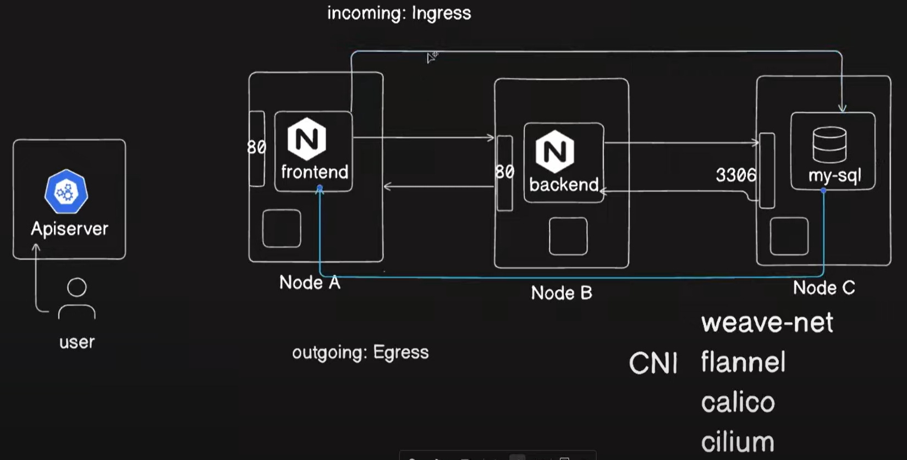 
  </div> <br>

- These network access policies are enforced by the network plugins. However, not all the CNI plugins support network policy configurations. 
- CNIs such as flannel, kindnet do not support network policies. 
- Now, create a kind cluster by disabling the default CNI plugin 
  ```
    kind create cluster --name=cka-new --config=kind_cluster.yaml
  ```
- Disable the default CNI plugin as done in the following configuration file, you need to install some other plugin, here we are going to use Calico CNI plugin.
  ```
    kind: Cluster
    apiVersion: kind.x-k8s.io/v1alpha4
    nodes:
    - role: control-plane
      extraPortMappings:
      - containerPort: 30001
        hostPort: 30001
    - role: worker
    - role: worker
    networking:
      disableDefaultCNI: true 
      podSubnet: 192.168.0.0/16
  ```
  
- Install the calico by manifest way as follows - 
  ```
    # Install Calico
    kubectl apply -f https://raw.githubusercontent.com/projectcalico/calico/v3.29.1/manifests/calico.yaml

    # Verify Calico Installation 
    kubectl get pods -l k8s-app=calico-node -A
  ```

- You can access the backend and database by logging in to the frontend 
  ```
    kubectl exec frontend -- bash        # Login to the Frontend Pod.
    curl frontend:80                     # Access frontend service from frontend
    curl backend:80                      # Access backend service from frontend
    telnet db 3360                       # Try to connect to the database 
  ```

- <span style="color: #e1881c"> Telnet Command in Linux </span>
  - Telnet command is a network protocol tool used for establishing text-based connections to remote systems. 
  - It operates over the TCP/IP protocol and is primarily utilized for testing connectivity, diagnosing network issues, and managing remote servers.
    ```
      telnet [hostname or IP address] [port]        # Basic syntax 
      telnet remote.example.com                     # Connect to remote server
      telnet example.com 22                         # Check if the port is open or not. If successful, you will see a connection message; 
                                                    # If not, an error will indicate that the port is closed or unreachable
    ```

- <span style="color: #e1881c"> Telnet Vs cURL </span>
  - Telnet can connect to any TCP port and allow users to manually send commands or data to services running on those ports (e.g., SMTP, FTP). 
  - This makes it a versatile tool for testing various types of services.
  - While cURL can interact with HTTP(S) services and some other protocols, it is not as flexible as Telnet for arbitrary TCP connections 
    and manual command entry.

- Network policy to prevent frontend from accessing the database and making sure that only backend can access the database
  ```
    apiVersion: networking.k8s.io/v1
    kind: NetworkPolicy
    metadata:
      name: test-network-policy
      namespace: default
    spec:
      podSelector:
        matchLabels:
          name: mysql
      policyTypes:
      - Ingress
      ingress:
      - from:
        - podSelector:
            matchLabels:
              role: backend
        ports:
        - protocol: TCP 
          port: 3306
  ```


<br>
<!-----------------------------------------------------------------------  This is comment   --------------------------------------------------------------------->
<!---------------------------------------------------------------------------------------------------------------------------------------------------------------->

---
# <pre style="padding: 0; margin: 0 0"> <div style="padding: 0 40%">   Day 27 </div>  </pre>
## <span style="color: #e1881c"> Setup a Multi Node Kubernetes Cluster Using Kubeadm </span>

- If you want to setup the kubernetes locally for testing/learning kubernetes or as a proof of concept then you can use one of the following options. These 
  options will use only one node and multiple pods. 
  1. Kind 
  2. K3S 
  3. Minikube 
  
- Following are the managed kubernetes options 
  1. EKS 
  2. AKS 
  3. GKE 

- Following are the self managed options for kubernetes 
  1. Vagrant/Virtualbox 
  2. multipass 
  3. VMs on cloud 
  4. bare metal / VMware 

  <br> <div style="text-align: center;">
  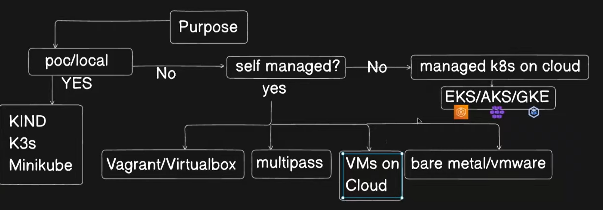 
  </div> <br>

- The following steps will be followed - 

  <br> <div style="text-align: center;">
  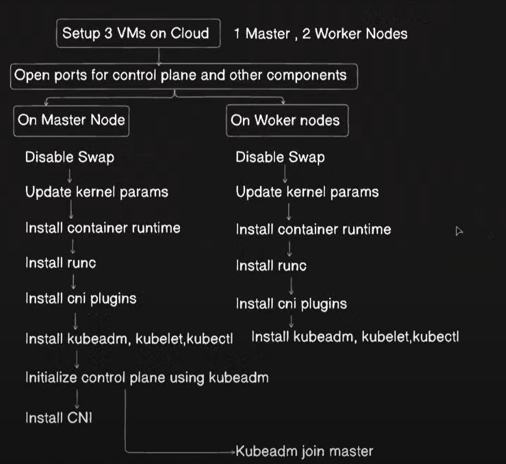 
  </div> <br>

- Following ports need to be opened - 
  
  <br> <div style="text-align: center;">
  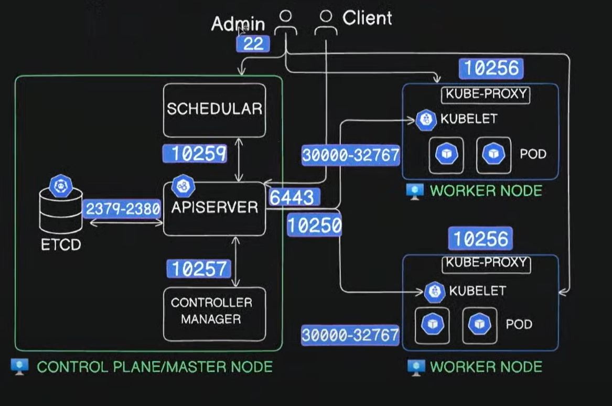 
  </div> <br>


<br>
<!-----------------------------------------------------------------------  This is comment   --------------------------------------------------------------------->
<!---------------------------------------------------------------------------------------------------------------------------------------------------------------->

---
# <pre style="padding: 0; margin: 0 0"> <div style="padding: 0 40%">   Day 28 </div>  </pre>
## <span style="color: #e1881c"> Docker Volume, Docker Bind Mount, Docker Persistent Storage </span>

<br>
<!-----------------------------------------------------------------------  This is comment   --------------------------------------------------------------------->
<!---------------------------------------------------------------------------------------------------------------------------------------------------------------->

---
# <pre style="padding: 0; margin: 0 0"> <div style="padding: 0 40%">   Day 29 </div>  </pre>
## <span style="color: #e1881c"> Kubernetes Volume | Persistent Volume, Persistent Volume Claim & Storage Class </span>

<br>
<!-----------------------------------------------------------------------  This is comment   --------------------------------------------------------------------->
<!---------------------------------------------------------------------------------------------------------------------------------------------------------------->

---
# <pre style="padding: 0; margin: 0 0"> <div style="padding: 0 40%">   Day 30 </div>  </pre>
## <span style="color: #e1881c"> what is DNS ? </span>

<br>
<!-----------------------------------------------------------------------  This is comment   --------------------------------------------------------------------->
<!---------------------------------------------------------------------------------------------------------------------------------------------------------------->

---
# <pre style="padding: 0; margin: 0 0"> <div style="padding: 0 40%">   Day 31 </div>  </pre>
## <span style="color: #e1881c"> Understanding CoreDNS in Kubernetes </span>

<br>
<!-----------------------------------------------------------------------  This is comment   --------------------------------------------------------------------->
<!---------------------------------------------------------------------------------------------------------------------------------------------------------------->

---
# <pre style="padding: 0; margin: 0 0"> <div style="padding: 0 40%">   Day 32 </div>  </pre>
## <span style="color: #e1881c"> Kubernetes Networking </span>

<br>
<!-----------------------------------------------------------------------  This is comment   --------------------------------------------------------------------->
<!---------------------------------------------------------------------------------------------------------------------------------------------------------------->

---
# <pre style="padding: 0; margin: 0 0"> <div style="padding: 0 40%">   Day 33 </div>  </pre>
## <span style="color: #e1881c"> Kubernetes Ingress </span>

<br>
<!-----------------------------------------------------------------------  This is comment   --------------------------------------------------------------------->
<!---------------------------------------------------------------------------------------------------------------------------------------------------------------->

---
# <pre style="padding: 0; margin: 0 0"> <div style="padding: 0 40%">   Day 34 </div>  </pre>
## <span style="color: #e1881c"> Upgrade a Multi Node Kubernetes Cluster With Kubeadm </span>

<br>
<!-----------------------------------------------------------------------  This is comment   --------------------------------------------------------------------->
<!---------------------------------------------------------------------------------------------------------------------------------------------------------------->

---
# <pre style="padding: 0; margin: 0 0"> <div style="padding: 0 40%">   Day 35 </div>  </pre>
## <span style="color: #e1881c"> Kubernetes ETCD Backup and Restore </span>

<br>
<!-----------------------------------------------------------------------  This is comment   --------------------------------------------------------------------->
<!---------------------------------------------------------------------------------------------------------------------------------------------------------------->

---
# <pre style="padding: 0; margin: 0 0"> <div style="padding: 0 40%">   Day 36 </div>  </pre>
## <span style="color: #e1881c"> Kubernetes Logging and Monitoring </span>

<br>
<!-----------------------------------------------------------------------  This is comment   --------------------------------------------------------------------->
<!---------------------------------------------------------------------------------------------------------------------------------------------------------------->

---
# <pre style="padding: 0; margin: 0 0"> <div style="padding: 0 40%">   Day 37 </div>  </pre>
## <span style="color: #e1881c"> Application Failure Troubleshooting From CKA </span>

<br>
<!-----------------------------------------------------------------------  This is comment   --------------------------------------------------------------------->
<!---------------------------------------------------------------------------------------------------------------------------------------------------------------->

--- 
# <pre style="padding: 0; margin: 0 0"> <div style="padding: 0 40%">   Day 38 </div>  </pre>
## <span style="color: #e1881c"> Troubleshooting Control Plane Failures </span>

<br>
<!-----------------------------------------------------------------------  This is comment   --------------------------------------------------------------------->
<!---------------------------------------------------------------------------------------------------------------------------------------------------------------->

---
# <pre style="padding: 0; margin: 0 0"> <div style="padding: 0 40%">   Day 39 </div>  </pre>
## <span style="color: #e1881c"> Troubleshooting Worker Node Failures </span>

<br>
<!-----------------------------------------------------------------------  This is comment   --------------------------------------------------------------------->
<!---------------------------------------------------------------------------------------------------------------------------------------------------------------->

---
# <pre style="padding: 0; margin: 0 0"> <div style="padding: 0 40%">   Day 40 </div>  </pre>
## <span style="color: #e1881c"> JSONPath Tutorial - Advanced Kubectl Commands </span>

<br>
<!-----------------------------------------------------------------------  This is comment   --------------------------------------------------------------------->
<!---------------------------------------------------------------------------------------------------------------------------------------------------------------->

---
# <pre style="padding: 0; margin: 0 0"> <div style="padding: 0 40%">   Day 41 </div>  </pre>
## <span style="color: #e1881c"> CKA Exam Tips - How To Clear CKA Exam in 2024 </span>

<br>
<!-----------------------------------------------------------------------  This is comment   --------------------------------------------------------------------->
<!---------------------------------------------------------------------------------------------------------------------------------------------------------------->

---
# <pre style="padding: 0; margin: 0 0"> <div style="padding: 0 40%">   Day 42 </div>  </pre>
## <span style="color: #e1881c"> Host Your Private Docker Registry On Kubernetes </span>
