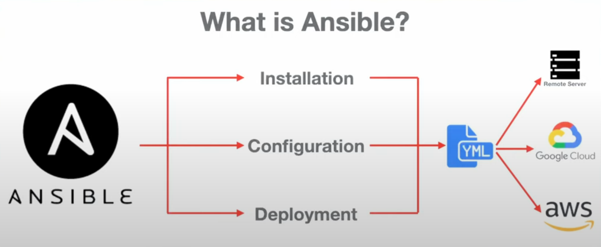

## Day-14.1 | Configuration Management With Ansible |Puppet vs Ansible |Live Projects

### What is Ansible ?
- Ansible is open source tool which helps in following 3 tasks -
  1. **Software Installation** - With Ansible the task of software installation on various servers can be automated.
  2. **Server Configuration** - Helps in managing server configuration i.e. addition, updating or deletion of the server configuration.
  3. **Deployment** - Helps in deployment of a web application on the server.

<br> <div style="text-align: center;">
 
</div> <br>

### 🔧 What is Configuration Management?

- **Configuration Management (CM)** is a key DevOps practice used to **automate the setup, maintenance, and enforcement of desired infrastructure states**.
- CM tools ensure **consistency, reliability, and scalability** in managing server environments, particularly as the number of servers increases.

### 👨‍💻 Traditional Approach (Before DevOps)
- Previously, **System Administrators** or **Build & Release Engineers** managed infrastructure manually. Their typical tasks included:

  - Software installations
  - OS upgrades
  - Applying security patches
  - Manual configuration of system settings

### 💡 Why Automation Became Necessary?

With the adoption of **microservices architecture**, applications now run on **multiple lightweight servers or containers**. This introduces challenges:

- Managing many servers manually is inefficient and error-prone.
- Writing custom scripts is difficult across heterogeneous OS environments (Windows, Ubuntu, CentOS, RHEL, etc.).
- The solution: Use **configuration management tools** to automate and standardize infrastructure setup.


### 🚀 Popular Configuration Management Tools

| Tool        | Developer              |
| ----------- | ---------------------- |
| Puppet      | Puppet Labs            |
| Chef        | Progress/Chef          |
| **Ansible** | **Red Hat**            |
| SaltStack   | VMware (formerly Salt) |

> Among these, **Ansible** has become the most popular due to its **simplicity, agentless architecture, and YAML-based syntax**.


### 🥊 Puppet vs Ansible – Feature Comparison

| **Feature**           | **Puppet**                                                         | **Ansible**                                                |
| --------------------- | ------------------------------------------------------------------ | ---------------------------------------------------------- |
| **Language**          | Uses its own **Domain Specific Language (DSL)**                    | Uses **YAML**, a human-readable syntax                     |
| **Agent-Based?**      | Yes – requires **agent installation** on managed nodes             | **Agentless** – uses **SSH or WinRM** to connect           |
| **Push vs Pull**      | **Pull model** – agents pull configurations from a master          | **Push model** – control node pushes configs to clients    |
| **Ease of Use**       | Moderate learning curve due to custom DSL                          | Beginner-friendly due to YAML and simple architecture      |
| **Architecture**      | **Master-Agent (Client-Server)** model                             | **Masterless** – uses a central **control node**           |
| **Idempotency**       | Yes (Both tools ensure the system reaches the desired state without repeating actions.)  | Yes                                  |
| **Setup Time**        | Slower setup due to agent configuration                            | Fast setup – no agent installation needed                  |
| **Community Support** | Mature, with a long history and large enterprise adoption          | Rapidly growing community and wide adoption                |
| **Best Use Case**     | Ideal for **large enterprise environments** with complex workflows | Great for **both small-scale and large-scale deployments** |

### 🔍 Notes on Ansible
- **Developed by:** Red Hat
- **Connection Methods:**
  - **Linux Nodes:** Uses **SSH**
  - **Windows Nodes:** Uses **WinRM (Windows Remote Management)**

- **Modules:** Written in **Python**, and shared via the **Ansible Galaxy** community.
- **Cloud Compatibility:** Works with **AWS, Azure, GCP, DigitalOcean**, and others. All it needs is **public IP access and SSH/WinRM connectivity**.
- **Platform Support:** Strong Linux support; Windows support is improving but still limited in comparison.
- **Limitations:**
  - Limited debugging features
  - Performance may lag for very large-scale deployments
  - Logging and error handling can be improved

### 💼 Real-World Use Cases of Ansible
1. **Provisioning** new cloud servers (e.g., AWS EC2)
2. **Automated patch management** across multiple servers
3. **Configuring software stacks** like LAMP, MEAN, ELK
4. **Managing Docker containers and Kubernetes nodes**
5. **Multi-cloud infrastructure setup** from a single playbook


## Day-14.2 | Answers to Ansible Interview Questions | DevOps FAQ | DevOps Interview Q&A

### ❓ **What is Configuration Management?**
- Configuration Management is the **automated process of managing and maintaining consistency of a system's configuration** (hardware, OS, software, network settings, etc.).
- Manual setup or shell scripts are **error-prone and inefficient** in large-scale deployments.
- Tools like Ansible, Puppet, and Chef are used to **automate, standardize, and enforce desired states** of infrastructure.

### ❓ **Is Ansible better than other Configuration Management tools? If yes, why?**
- Yes, Ansible has several advantages:

  - **Agentless:** No need to install agents on target nodes. Uses standard SSH/WinRM.
  - **Simple Syntax:** Uses **YAML** for playbooks (easy to learn and readable).
  - **Python-Based:** Written in Python and easily extensible.
  - **Backed by Red Hat:** Actively maintained and supported.
  - **Cross-Platform Support:** Works on Linux and Windows.
  - **Lightweight & Scalable:** Easy to get started but powerful for large environments.

### ❓ **Write an Ansible Playbook to install and start `httpd` service (Apache)**
- Step 1 : Install http service
- Step 2 : Start http service
- Step 3 : Start http service

  ```yaml
  ---
  - name: Install and start Apache httpd service
    hosts: webservers
    become: true
  
    tasks:
      - name: Install httpd
        yum:
          name: httpd
          state: present
  
      - name: Start and enable httpd service
        service:
          name: httpd
          state: started
          enabled: yes
  ```

### ❓ **How has Ansible helped in your organization?**

**Example scenario:**

> In our organization, we used Ansible to automate provisioning of 50+ EC2 instances with required software stacks (Nginx, Docker, Prometheus). Manual setup used to take hours, but with Ansible playbooks, we reduced provisioning time to just a few minutes, with 100% consistency and zero configuration drift.

### ❓ **What is Ansible Dynamic Inventory?**
- Dynamic inventory allows Ansible to **automatically fetch hosts from cloud providers (e.g., AWS, Azure, GCP)** instead of manually listing them in `hosts` files.
- Example: Use a Python script or AWS plugin to pull EC2 IPs with specific tags.
- Useful in **auto-scaling environments** where IPs change frequently.
- Ansible will track the EC2 instances that are being created and will auto-configure them.

### ❓ **What is Ansible Tower? Have you used it?**
- **Ansible Tower** is the **enterprise GUI and REST API** interface for Ansible by Red Hat.
- Key Features:

  - Visual dashboard
  - Role-based access control (RBAC)
  - Centralized logging & auditing
  - Scheduling playbooks
  - Integration with LDAP, GitHub, and external vaults
- Yes, I’ve used Tower to provide **access control and scheduling** for multiple teams, avoiding manual CLI usage.

### ❓ **How do you manage RBAC in Ansible Tower?**
- Ansible Tower supports **granular RBAC** via user roles:

  - **Admin**: Full control
  - **Auditor**: Read-only
  - **Operator**: Run existing playbooks
- You can assign users/groups different **permissions per project, inventory, job template**, etc.
- Integrates with **LDAP/AD** for centralized identity management.

### ❓ **What is the `ansible-galaxy` command and why is it used?**
- `ansible-galaxy` is a CLI tool to **download, create, share, and manage Ansible roles** from [Ansible Galaxy](https://galaxy.ansible.com/).
- Example:

  ```bash
  ansible-galaxy install geerlingguy.apache
  ```

### ❓ **Explain the structure of an Ansible Playbook using Roles**
- Ansible role structure:

  ```
  roles/
    webserver/
      tasks/
      handlers/
      files/
      templates/
      vars/
      defaults/
      meta/
  ```

- Usage in playbook:

  ```yaml
  - hosts: webservers
    roles:
      - webserver
  ```

> Roles promote **modularity, reusability, and clean organization** of complex playbooks.

### ❓ **What are Handlers in Ansible and why are they used?**
- Handlers are **tasks triggered only when notified** by another task.
- Use-case: Restart service **only when a config file changes**.

  ```yaml
  - name: Copy config
    copy:
      src: my.conf
      dest: /etc/my.conf
    notify: Restart service
  
  handlers:
    - name: Restart service
      service:
        name: myservice
        state: restarted
  ```

### ❓ **How to run tasks on Windows VMs and not on Linux VMs?**
- Use **`when` conditions** with **`ansible_os_family`** or **`ansible_system`** facts.

  ```yaml
  - name: Run on Windows only
    win_shell: echo "Running on Windows"
    when: ansible_system == "Windows"
  ```

### ❓ **Does Ansible support parallel execution of tasks?**
- Yes. Ansible runs tasks **in parallel across multiple hosts** by default.
- Parallelism is controlled using the `forks` setting in `ansible.cfg`.

  ```ini
  [defaults]
  forks = 10
  ```

### ❓ **What is Variable Precedence in Ansible?**
- Ansible resolves variables in the following order (high to low priority):

  1. Extra vars (`ansible-playbook play.yml -e var=value`)
  2. Task vars (set\_fact)
  3. Block vars
  4. Role defaults
  5. Inventory vars
  6. Playbook vars
  7. Facts
  8. Defaults (lowest)

> The **last defined value with highest precedence** is the one applied.

### ❓ **How does Ansible handle secrets?**
- Ansible uses **Ansible Vault** to encrypt secrets like passwords or API keys.

  ```bash
  ansible-vault create secrets.yml
  ansible-vault edit secrets.yml
  ansible-playbook site.yml --ask-vault-pass
  ```
- Secrets can be embedded in vars files or role defaults securely.

### ❓ **Can Ansible be used for Infrastructure as Code (IaC)?**
- Yes. Ansible can **provision servers, install software, configure environments, and manage infrastructure states**, just like Terraform or CloudFormation.
- While Terraform is declarative and focuses more on infrastructure provisioning, **Ansible can manage both provisioning and configuration**.

<br>

## Day-15 | Ansible Zero to Hero 

### ✅ Install Ansible on Linux
  ```bash
  sudo apt update                     # Update the package list
  sudo apt install ansible -y        # Install Ansible
  ansible --version                  # Check Ansible version and confirm installation
  ```

### 🧠 Basic Concepts
- **Control Node**: The machine from which Ansible commands are run. It manages other nodes (target machines).
- **Managed Nodes**: The target machines that Ansible configures.
- The control node must be able to connect to managed nodes using passwordless SSH or WinRM (for Windows).


### 📂 Inventory File
- Ansible uses an inventory file to know which machines to configure.
- Default location: `/etc/ansible/hosts`
- You can also create a custom inventory file.
- Inventory file stores IP addresses of the machines that need to be configured.

#### **Example: `inventory`**

  ```ini
  [dbservers]
  172.31.62.28
  
  [webservers]
  172.31.62.100
  ```

### ⚡ Ad-Hoc Commands
- Ad-hoc commands are quick commands you run from the terminal.
- Playbooks are the files written in Ansible which contain commands/instructions for configuring the servers.

  ```bash
  ansible -i inventory all -m shell -a "touch filename"
  ```

- `-i inventory`: Specifies the inventory file.
- `all`: Run the command on all hosts listed in inventory file.
- `-m shell`: Use the shell module.
- `-a`: Specify the shell command to execute, an argument to the module.

### **Color Legend:**
- The color of the Ansible command output tells about the status of the operation
  - **Yellow output** = Task successful but something changed
  - **Green output** = Task was already OK
  - **Red output** = Task failed

### ❗ Common Mistake
- ❌ `ansible-playlist`
- ✅ `ansible-playbook`

### 🔄 Difference: Ad-Hoc vs Playbooks
- Adhoc commands are preferred over playbooks for simple tasks.
- `ansible` is used for running `ansible adhoc` commands whereas `ansible-playlist` command is used for running ansible playbook commands.

| Feature     | Ad-Hoc Commands | Playbooks                        |
| ----------- | --------------- | -------------------------------- |
| Use Case    | One-time tasks  | Complex, reusable configurations |
| Format      | Shell commands  | YAML File                        |
| Reusability | Not reusable    | Fully reusable                   |
| Example     | Create a file   | Install Nginx with config        |

### 🔧 Run on Specific Host or Group

#### **Run on group:**
- 
  ```bash
  ansible -i inventory webservers -m shell -a "df -h"
  ```

#### **Run on a specific host:**
- Run an Ansible command for a single server from inventory 

  ```bash
  ansible -i inventory 172.31.62.28 -m shell -a "df -h"
    # '-m shell' tells ansible to use shell module
  # '-a df' is an argument for the shell module
  ```

### 📘 Playbook Example: Install & Start Nginx

Filename: `install_nginx.yml`

```yaml
---
- name: Install and Start Nginx Web Server
  hosts: webservers
  become: yes

  tasks:
    - name: Update apt cache
      apt:
        update_cache: yes

    - name: Install Nginx
      apt:
        name: nginx
        state: present

    - name: Ensure Nginx is started and enabled
      service:
        name: nginx
        state: started
        enabled: yes
```
### 🧾 Inventory Entry for EC2 and categorizing servers in Inventory file 
- Servers can be categorized from 'inventory' file as follows 
  
  ```ini
  [webservers]
  172.31.88.77 ansible_user=ubuntu ansible_ssh_private_key_file=~/.ssh/your_key.pem

  [webservers]
  172.31.62.100
  ```
- Now, Ansible command can be run on particular type of servers as follows -

  ```bash
  ansible -i inventory webserver -m shell -a df
  ```
- Refer documentation for knowing more about Ansible modules and their arguments.
  
### Playbook for installing and starting the Nginx - ` install_nginx.yaml `

  ```bash
  ---
  # The Tripple '-' at the beginning of the file indicates that it is yaml file.
  # This playbook installs and starts the Nginx web server on target hosts.
  
  - name: Install and Start Nginx Web Server
    hosts: webservers          # Target group of hosts defined in the inventory file
    become: yes                # Elevate privileges using sudo
  
    tasks:
      - name: Update apt cache
        apt:
          update_cache: yes    # Ensures the package list is up to date
        # This step helps avoid issues with outdated package indexes
  
      - name: Install Nginx
        apt:
          name: nginx          # Specifies the package name
          state: present       # Ensures nginx is installed
        # This step installs nginx if it's not already installed
  
      - name: Ensure Nginx is started and enabled
        service:
          name: nginx          # Specifies the service name
          state: started       # Starts nginx service if not running
          enabled: yes         # Enables nginx to start on system boot
        # This ensures nginx is running now and after reboots
  ```

#### 📁 Example Inventory File (inventory)
  ```ini
  [webservers]
  172.31.88.77 ansible_user=ubuntu ansible_ssh_private_key_file=~/.ssh/your_key.pem
  ```

#### ▶️ Run the Playbook
  ```bash
  ansible-playbook -i inventory install_nginx.yml
  ```

### Ansible Roles 
- Ansible Roles is used to write structured and efficient ansible playbooks.
- Roles help in writing reusable and structured playbooks.

  ```bash
  ansible-galaxy role init kubernetes   # Create a role named 'kubernetes'
  ```

- This will create a directory `kubernetes\` with following structure 

  ```
  kubernetes/
  ├── defaults/       # Store default variables
  ├── files/          # Stores static files like .html or certificates
  ├── handlers/       # Used for service notifications via email etc (e.g., restart on config change)
  ├── meta/           # Metadata such as license info and dependencies
  ├── tasks/          # Main tasks (main.yml)
  ├── templates/      # Jinja2 templates
  ├── tests/          # Test playbooks
  ├── vars/           # Custom variables
  └── README.md       # Description and documentation
  ```

### 🧠 Ansible Dynamic Inventory
- Dynamic Inventory allows Ansible to fetch host lists from cloud providers (like AWS, Azure).
- Useful for auto-scaling environments.
- Requires plugins like `aws_ec2`, `azure_rm`, etc.

#### **Example command with AWS EC2 plugin:**
  
  ```bash
  ansible-inventory -i aws_ec2.yml --graph
  ```

### 🧱 Using Roles in Playbooks
- Roles let you split complex playbooks into modular directories. 
- After initializing a role (e.g., `kubernetes`), use it in a playbook as shown below.

#### **Example: `site.yml` (Main Playbook)**

  ```yaml
  ---
  - name: Apply Kubernetes Role
    hosts: all
    become: yes
  
    roles:
      - kubernetes
  ```

#### **Directory structure for this setup:**

  ```
  site.yml
  roles/
  └── kubernetes/
      ├── tasks/
      │   └── main.yml
      ├── handlers/
      ├── templates/
      ├── files/
      ├── vars/
      ├── defaults/
      ├── meta/
      └── README.md
  ```

#### **Example: `roles/kubernetes/tasks/main.yml`**

  ```yaml
  ---
  - name: Install Docker
    apt:
      name: docker.io
      state: present
  
  - name: Start Docker
    service:
      name: docker
      state: started
      enabled: yes
  ```

#### **Run it like this:**

  ```bash
  ansible-playbook -i inventory site.yml
  ```

### ⭐ Ansible Galaxy
- Ansible Galaxy is a hub for finding and sharing community-developed Ansible roles and collections.

#### 📦 Install a Role from Galaxy

  ```bash
  ansible-galaxy install geerlingguy.nginx
  ```

- This downloads the role into `/etc/ansible/roles/` (or your configured role path).

#### 📚 Use the Installed Role in a Playbook

  ```yaml
  ---
  - name: Use Nginx Role
    hosts: webservers
    become: yes
  
    roles:
      - geerlingguy.nginx
  ```

#### 🌍 Browse Ansible Galaxy
- Go to: [https://galaxy.ansible.com](https://galaxy.ansible.com)
- You’ll find hundreds of roles for managing databases, web servers, cloud infra, and more.


## 📄 Ansible Ad-Hoc Commands & Modules Cheat Sheet
- Ad-hoc commands are one-liners you use for quick tasks, unlike playbooks (for repeatable setups).

### 🔧 Basic Command Syntax

  ```bash
  ansible <target> -i <inventory> -m <module> -a "<module options>"
  ```

- `<target>` = group name or host from inventory (`all`, `webservers`, `192.168.1.10`)
- `<module>` = Ansible module (`ping`, `shell`, `copy`, etc.)
- `-i inventory` = inventory file

### 🧪 Testing Connectivity

```bash
ansible all -i inventory -m ping
```

#### 📂 File & Directory Operations
- **Create file**

  ```bash
  ansible all -i inventory -m file -a "path=/tmp/testfile state=touch"
  ```

- **Create directory**

  ```bash
  ansible all -i inventory -m file -a "path=/tmp/mydir state=directory"
  ```

- **Copy file**

  ```bash
  ansible all -i inventory -m copy -a "src=./localfile.txt dest=/tmp/remotefile.txt"
  ```

#### 🖥️ Shell & Command Modules
- **Run shell command**

  ```bash
  ansible all -i inventory -m shell -a "uptime"
  ```

- **Run system command (without shell)**

  ```bash
  ansible all -i inventory -m command -a "ls -l /tmp"
  ```

#### 🧰 Package Management
- **Install Apache (Ubuntu)**

  ```bash
  ansible all -i inventory -m apt -a "name=apache2 state=present update_cache=true" --become
  ```

- **Install Apache (CentOS/RHEL)**

  ```bash
  ansible all -i inventory -m yum -a "name=httpd state=present" --become
  ```

- **Start service**

  ```bash
  ansible all -i inventory -m service -a "name=apache2 state=started enabled=yes" --become
  ```

#### 👥 User Management
- **Create a user**

  ```bash
  ansible all -i inventory -m user -a "name=john state=present"
  ```

- **Add user to sudo group**

  ```bash
  ansible all -i inventory -m user -a "name=john groups=sudo append=yes" --become
  ```

#### 🔐 Manage SSH Keys
- **Copy public key to user**

  ```bash
  ansible all -i inventory -m authorized_key -a "user=ubuntu key='{{ lookup('file', '/home/user/.ssh/id_rsa.pub') }}'"
  ```

#### 📦 File Permissions

- **Change file permissions**

  ```bash
  ansible all -i inventory -m file -a "path=/tmp/testfile mode=0644"
  ```

- **Change file owner**

  ```bash
  ansible all -i inventory -m file -a "path=/tmp/testfile owner=ubuntu group=ubuntu"
  ```

#### 💬 Debugging & Output

- **Print debug message**
  *(Useful in playbooks)*

  ```yaml
  - name: Show debug message
    debug:
      msg: "The value of variable is {{ my_var }}"
  ```

#### 📌 Tips
- Always use `--become` for tasks requiring root.
- Use `-k` for password-based SSH and `--ask-become-pass` if sudo password is required.
- Use inventory groups to organize hosts by purpose.
