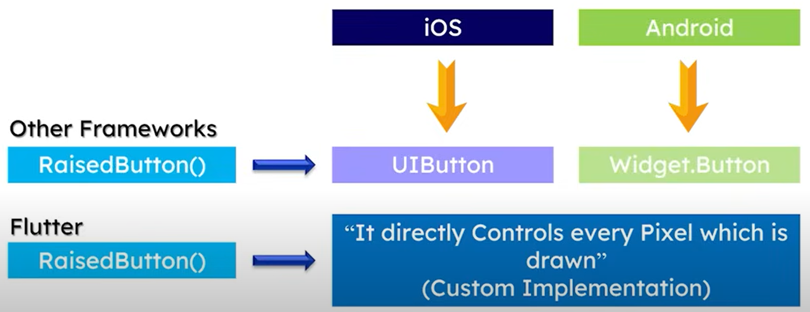

# <span style="color: #e1881c">  Flutter Tutorial  </span>
### [ By courtesy of YouTube Channel WsCube Tech :- https://youtu.be/1bQwDO88Gyw]
### Notes By - Rakesh Patil
---

Flutter Docs/Tutorial - https://pub.dev, https://dart.dev

Flutter is a tool that allows you to build native cross-platform (Android, iOS, web, desktop) applications with one programming language and code base.

## <span style="color: #e1881c">  What is Native + Cross Platform ?  </span>

### 1. cross-platform
A cross-platform computer product or system is a product or system that can work across multiple types of platforms or operating environments.\
Cross platform is also known as multi-platform or platform independent.\
Write code once and reuse for different platforms.
  - Flutter and React-native are used for cross-platform applications development.

### 2. Native
An application developed exclusively for a single platform using a native-to-the-operating-system-language is a native app.
For example : \
    &nbsp;&nbsp;&nbsp;&nbsp; For developing an application for Android, you'd need to develop apps in Java or Kotlin and UI should be developed using html and xml.
  - Android - Android Studio as IDE and Java or Kotlin as languages.
  - IOS - Xcode as IDE and Swift and Object C as languages.
     
### 3. Hybrid 
A blend solution that consists of both native and web solutions.\
Developers embed the code written with web development languages such as HTML, CSS, and Javascript into a native app using plugins like Apache Cordova or Ionic's capacitor.
- Visual Studio as an IDE and an Ionic framework are used for development.

## <span style="color: #e1881c">  How flutter is better than other cross-platforms ?  </span>

- When we develop an app using flutter then the implementation of that app is of flutter's on custom implementation i.e. the application will be rendered using flutter's own render engine.
- This approach reduces dependency on the native components and thus complex UIs can be developed using flutter.
- For example, as shown in following diagram, when we want to render a raised button on the screen, and if we use other cross-platform frameworks, then these frameworks will call native components to render the raised button, i.e. `UIButton` will be called on iOS and `Widget.Button` on Android. Whereas, flutter will directly draw the raised button on screen by controlling each pixel of the screen.

<br> 
<div style="text-align: center;">

</div>
<br> 

### Benefits of Flutter
  1. Increase Time-to-Market speed.
  2. Reduced code development time.
  3. The potential ability to go beyond mobile.
  4. Same UI and business logic in all platforms.
  5. Custom, Animated UI of any complexity available.
  6. Similar to native app performance.
  7. On render engine.
  8. Simple platform specific logic implementation. Only that language will be used for both front-end and back-end.
  
## <span style="color: #e1881c">  Flutter Architecture  </span>
- Flutter is all about widgets. When we are building an application in a sense, we are building a widget tree.
- Conditional programming can be used, if we want to enable some features depending on the platform such as Android, iOS or Windows .
- Flutter does not provide you any visual editor where you can drag and drop the components to create them.
- Dart programming language is a combination of three programming languages viz Java, JavaScript, C# and CScript.

### Requirements for flutter development on windows
Flutter SDK
: https://docs.flutter.dev/get-started/install/windows/mobile

Android Studio / SDK 
: https://developer.android.com/studio


## <span style="color: #e1881c"> Dart Commands </span>
```bash
  # Creates a new Dart project specifically designed for console applications
  dart create -t console asynchronous_programming   

  # Command monitors the "bin/" directory for any changes. When a change is detected, it clears the terminal and executes the Dart script.
  fswatch -o bin/ | xargs -n1 -I{} sh -c 'clear; dart bin/example1.dart 

  # You can also use 'nodemon' utility to run the dart code every time you save the code file.
  nodemon -x "dart run bin/variables_data_types.dart" -e dart

  # Directory structure of the project created using 'dart create' command.
  /bin      # contains the actual application dart code 
  /lib      # contains libraries imported inside the dart code
  /test     # Contains the test cases for the application    
```

## <span style="color: #e1881c"> Flutter Commands </span>
```
  flutter create project_name  :- Creates a project named "project_name"
  (OR)
  flutter create --platforms=android,ios,web,windows,macos,linux --project-name project1 .
                               :- Create a flutter project with name "project1" for all the platforms specified. 

  flutter config --enable-web                 :- To enable already created flutter app for Web browsers
  flutter config --enable-windows-desktop     :- To enable already created flutter app for Windows desktop
  flutter config --enable-macos-desktop       :- To enable already created flutter app for Macos desktop
  flutter config --enable-linux-desktop       :- To enable already created flutter app for Linux desktop


  flutter config               :- Check flutter configuration 

  flutter devices              :- List all connected devices available for running Flutter applications
                                  The output of this command is in the format below -
                                  Device Name • Device ID • Platform • Version Information 

  flutter run -d <device_id>   :-  Running a flutter application on a particular device id.


```

## <span style="color: #e1881c"> An Overview of the generated files and folders </span>

  1. .idea 
      - The .idea folder contains your code editor's project related settings specific files. 
      - No need to make any manual changes here.

  2. android / ios(iPhone) / linux / macos / web / windows 
      - These platform specific folders inside the flutter project contains the platform specific settings, resources and code. 
      - If you want to write any platform specific code you will write here. Rarely, you will need to make any changes to these files.

  3. build 
      - The build folder contains the output generated when you build or run the flutter project.
      - You will find all the release related files or folders like apks and app bundles in here.

  4. lib 
      - It is the main folder where you will write all the flutter app related code. Initially it contains just single 
        file, main.dart, which is an entry point for the flutter app.
  
  5. test 
      - Contains automatic testing related code and test cases. You need to write test cases in this folder.
  
  6. .gitignore 
      - Add the names of the files to .gitignore, that you do not want to track using Git version control system.
  
  7. .metadata 
      - Contains flutter project-related metadata.
      - You should not make any manual changes to this file.
      
  8. .packages 
      - Flutter project is composed of numerous libraries and packages. Some are pre-installed while others are 
      downloaded during development.
      - .packages holds the paths to each of these libraries/packages in your local computer.
      - You need not make any manual changes to this file.
      
  9. pubspec.yaml 
      - Contains flutter app specific configurations.
      - Dependencies such as external packages, image assets, font files, app versions etc. is configured with the 
        help of this file.

  10. pubspec.lock 
      - It is a helper file created from pubspec.yaml file when you build the app.
      - It lists specific versions of each dependency and makes sure that versions stay consistent across different
        different developer machines.
      - No need to make any changes here.
   
  11. README.md 
      - It is a mark down format file used primarily to describe your project in Git repo.
      - It describes what project does and how to use it.
