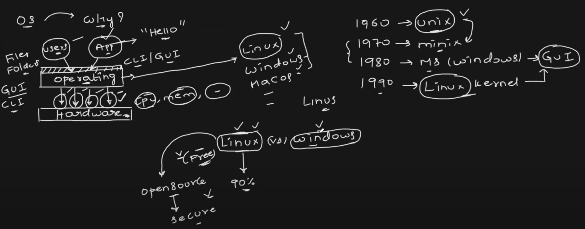

# Operating System 
- Users interact with Operating System using CLI or GUI.

<br> <div style="text-align: center;">
 
</div> <br>

# Linux over Windows

### Cost-Effectiveness
- **Free and Open Source**   
  Linux does not require expensive licensing fees, making it a cost-effective choice for companies.

- **Lower Maintenance Costs**   
  Linux is stable and requires minimal maintenance, reducing operational expenses.

### Performance and Efficiency

- **Better Resource Utilization**   
  Linux is lightweight and consumes fewer system resources compared to Windows.

- **High Scalability**    
  Linux efficiently scales from small embedded systems to enterprise data centers without performance degradation.

### Security and Reliability
- **Less Vulnerable to Malware**    
  Linux has strong user privilege separation, making it more secure against viruses and malware.

- **Frequent and Transparent Updates**    
  Regular security patches ensure system stability without requiring frequent reboots.

- **High Stability**   
  Linux systems can run for years without crashes, ensuring better uptime and reliability.

<br/>
<br/>

# Core components of a Linux Machine (Linux Structure)

```plaintext
+----------------------------------------------------+
| User Applications (Vim, Docker, Apache, etc.)     |
+----------------------------------------------------+
| Shell (Bash, Zsh, Fish, etc.)                     |  <-- Part of the OS
+----------------------------------------------------+
| System Libraries (glibc, libc, OpenSSL, etc.)     |  <-- Part of the OS
+----------------------------------------------------+
| System Utilities (ls, grep, systemctl, etc.)      |  <-- Part of the OS
+----------------------------------------------------+
| Linux Kernel (Process, Memory, FS, Network)       |  <-- Core of the OS
+----------------------------------------------------+
| Hardware (CPU, RAM, Disk, Network, Peripherals)   |
+----------------------------------------------------+
```

### 1. Hardware Layer
  - The physical components of the computer (`CPU`, `RAM`, `disk`, `network interfaces`, etc.).
  - The OS interacts with hardware using device drivers.

### 2. Kernel (Core of Linux OS)
  - **The Linux Kernel is responsible for directly managing system resources, including** :
  
    - **Process Management** – Schedules processes and handles multitasking.
  
    - **Memory Management** – Allocates and deallocates RAM efficiently.
    - **Device Drivers** – Acts as an interface between software and hardware.
    - **File System Management** – Manages how data is stored and retrieved.
    - **Network Management** – Handles communication between systems.

### 3. Shell (Command Line Interface - CLI)
  - A command interpreter that allows users to interact with the kernel.
  - Examples: `Bash`, `Zsh`, `Fish`, `Dash`, `Ksh`.
  - Converts user commands into system calls for the kernel.

### 4. User Applications
  - End-user programs like web browsers, text editors, DevOps tools, etc.
  - Applications interact with the OS using system calls via the shell or GUI.

<br/>
<br/>

# Linux Distributions

- Linux distributions (`distros`) are different versions of Linux that package the Linux kernel with various software, system utilities, and package managers. 
- Each `distro` is designed for different use cases, such as `personal computing`, `server management`, or `security`.

- Here are some popular Linux distributions:

  1. **Ubuntu** –  
    One of the most beginner-friendly distros, widely used for personal and server use. It has great community support.

  2. **CentOS (discontinued, replaced by AlmaLinux/Rocky Linux)** –   
    Previously a popular choice for servers, based on Red Hat Enterprise Linux (RHEL).

  3. **Debian** –  
    A very stable and reliable distro, often used as a base for other distros like Ubuntu.

  4. **Fedora** –  
    A cutting-edge distro that introduces new features before they reach RHEL.

  5. **Arch Linux** –  
    A lightweight, rolling-release distro for advanced users who like customization.

  6. **Kali Linux** –   
    Designed for cybersecurity and penetration testing.

  7. **Alpine Linux** –  
    A lightweight, security-focused distro often used in containers.


### Useful References:

- Linux Kernel Source code:
http://git.kernel.org/

- Mirror of Linux Kernel on GitHub:
http://github.com/torvalds/linux

<br/>
<br/>

# Setup Linux Environment on Windows and MacOS

There are multiple ways to setup a Linux environment on a Windows or Mac machines such as `cloud vm`, `wsl2`, `virtualbox`, `Hyperkit` e.t.c.,. However what I would recommend is using a container as a Linux environment.

Just install Docker desktop, run the below command and create linux container of any distribution without worrying about the cost and connectivity issues.

### Docker Command to Run Ubuntu Linux Container in windows host (Persistent & Long-Term) 

- Docker command to run container on windows 

  ```bash
  docker run -dit \
    --name ubuntu-container \
    --hostname ubuntu-dev \
    --restart unless-stopped \
    --cpus="2" \
    --memory="4g" \
    --mount type=bind,source=C:/ubuntu-data,target=/data \
    -v /var/run/docker.sock:/var/run/docker.sock \
    -p 2222:22 \
    -p 8080:80 \
    --env TZ=Asia/Kolkata \
    --env LANG=en_US.UTF-8 \
    ubuntu:latest /bin/bash
                   
  ```

- One more docker command to run container on windows. 
  
  ```bash
  # Create and Run the container
  docker run -dit  --name ubuntu-container  --hostname ubuntu-dev  --restart unless-stopped  --cpus="2"  --memory="4g"  --mount type=bind,source=C:/Users/Rakesh/docker_files,target=/data  -v /var/run/docker.sock:/var/run/docker.sock  -p 2222:22  -p 8080:80  --env TZ=Asia/Kolkata  --env LANG=en_US.UTF-8  ubuntu:latest /bin/bash

  # Run bash inside "ubuntu-container" container 
  docker exec -it ubuntu-container //bin//bash
  ```

### Docker Command to Run Ubuntu Linux Container in mac or linux host (Persistent & Long-Term) 

```bash
docker run -dit \
  --name ubuntu-container \
  --hostname ubuntu-dev \
  --restart unless-stopped \
  --cpus="2" \
  --memory="4g" \
  --mount type=bind,source=/tmp/ubuntu-data,target=/data \
  -v /var/run/docker.sock:/var/run/docker.sock \
  -p 2222:22 \
  -p 8080:80 \
  --env TZ=Asia/Kolkata \
  --env LANG=en_US.UTF-8 \
  ubuntu:latest /bin/bash
                 
```

## Explanation of Each Parameter

| Parameter | Description |
|-----------|-------------|
| `-dit` | Runs the container in **detached (-d)**, **interactive (-i)**, and **terminal (-t)** mode. |
| `--name ubuntu-container` | Assigns a name to the container for easy management. |
| `--hostname ubuntu-dev` | Sets the container’s hostname. |
| `--restart unless-stopped` | Ensures the container restarts automatically unless manually stopped. |
| `--cpus="2"` | Limits the container to **2 CPU cores**. |
| `--memory="4g"` | Allocates **4GB RAM** to the container. |
| `--mount type=bind,source=C:/ubuntu-data,target=/data` | **Mounts a folder** from Windows into the container to persist data. |
| `-v /var/run/docker.sock:/var/run/docker.sock` | Allows running Docker commands inside the container (optional). |
| `-p 2222:22` | Maps port **2222** on the host to **22** (SSH) inside the container. |
| `-p 8080:80` | Maps port **8080** on the host to **80** (for web services). |
| `--env TZ=Asia/Kolkata` | Sets the **timezone** (modify based on your location). |
| `--env LANG=en_US.UTF-8` | Sets the **language** settings inside the container. |
| `ubuntu:latest /bin/bash` | Uses the latest **Ubuntu** image and runs Bash shell. |

<br/>
<br/>

# Package Managers in Linux

## 📌 What is a Package Manager?
A **package manager** is a tool that automates the process of installing, updating, configuring, and removing software in a Linux system. It ensures that software and its dependencies are managed efficiently.

## 🔍 How Does a Package Manager Work?
1. **Repositories (Repos):**
  - A package manager fetches software from **official repositories (online storage of packages).**
  - Example: Ubuntu gets packages from `archive.ubuntu.com`.

2. **Installing Software:**
  - When you install software, the package manager  
    - ✅ Downloads the package from the repository.
    - ✅ Resolves dependencies (installs additional required software).
    - ✅ Installs and configures the software automatically.

3. **Updating Software:**
  - A single command updates all installed packages to the latest version.

4. **Removing Software:**
  - The package manager also **removes** software cleanly without leaving unnecessary files.

## 📦 Popular Package Managers in Linux
-
  | Linux Distro          | Package Manager                     | Command Example             |
  |---------------------- |------------------------------------ | --------------------------- |
  | Ubuntu, Debian        | `apt` (Advanced Package Tool)       | `sudo apt install nginx`    |
  | Fedora, RHEL, CentOS  | `dnf` (or `yum` for older versions) | `sudo dnf install nginx`    |
  | Arch Linux            | `pacman`                            | `sudo pacman -S nginx`      |
  | OpenSUSE              | `zypper`                            | `sudo zypper install nginx` |

## 🌍 How Package Managers Fetch Software from Repositories

- A **repository** is a server that stores software packages. When a package manager installs software:
  
  1. It **checks the repository list** (e.g., `/etc/apt/sources.list` in Ubuntu).
  
  2. It **downloads the package** and its dependencies.
  
  3. It **installs and configures the software** automatically.

### 📁 Example of an Ubuntu Repository Entry
```plaintext
Types      : deb
URIs       : http://ports.ubuntu.com/ubuntu-ports/
Suites     : noble noble-updates noble-backports noble-security
Components : main universe restricted multiverse
Signed-By  : /usr/share/keyrings/ubuntu-archive-keyring.gpg
```

## 🔄 Why Should You Run `apt update` After Installing Ubuntu?
When you install Ubuntu, the packages included in the ISO image might be outdated. Running:
```bash
apt install sudo
sudo apt update
```
✅ Updates the package list from repositories.

Then, to install the latest versions of packages, run:
```bash
sudo apt upgrade -y
```

## 🛠 Essential Package Manager Commands
### **APT (Debian, Ubuntu)**
```bash
sudo apt update         # Update package lists
sudo apt upgrade -y     # Upgrade installed packages
sudo apt install nginx  # Install a package
sudo apt remove nginx   # Remove a package
sudo apt autoremove     # Remove unused dependencies
sudo apt search nginx   # Search for a package
```

### **DNF (Fedora, RHEL, CentOS)**
```bash
sudo dnf check-update   # Check for updates
sudo dnf update         # Update all packages
sudo dnf install nginx  # Install a package
sudo dnf remove nginx   # Remove a package
```

### **Pacman (Arch Linux)**
```bash
sudo pacman -Syu        # Sync and update all packages
sudo pacman -S nginx    # Install a package
sudo pacman -R nginx    # Remove a package
```

### **Zypper (OpenSUSE)**
```bash
sudo zypper refresh        # Refresh package list
sudo zypper update         # Update all packages
sudo zypper install nginx  # Install a package
sudo zypper remove nginx   # Remove a package
```

## 🚀 Best Practices for Using Package Managers

- ✅ **Always update your package list before installing software:**

  ```bash
  sudo apt update && sudo apt upgrade -y
  ```

- ✅ **Use `autoremove` to clean up unused dependencies:**

  ```bash
  sudo apt autoremove
  ```

- ✅ **Enable automatic security updates (Ubuntu):**

  ```bash
  sudo apt install unattended-upgrades
  sudo dpkg-reconfigure unattended-upgrades
  ```

---
This document provides a solid foundation for understanding package managers in Linux! 🚀
